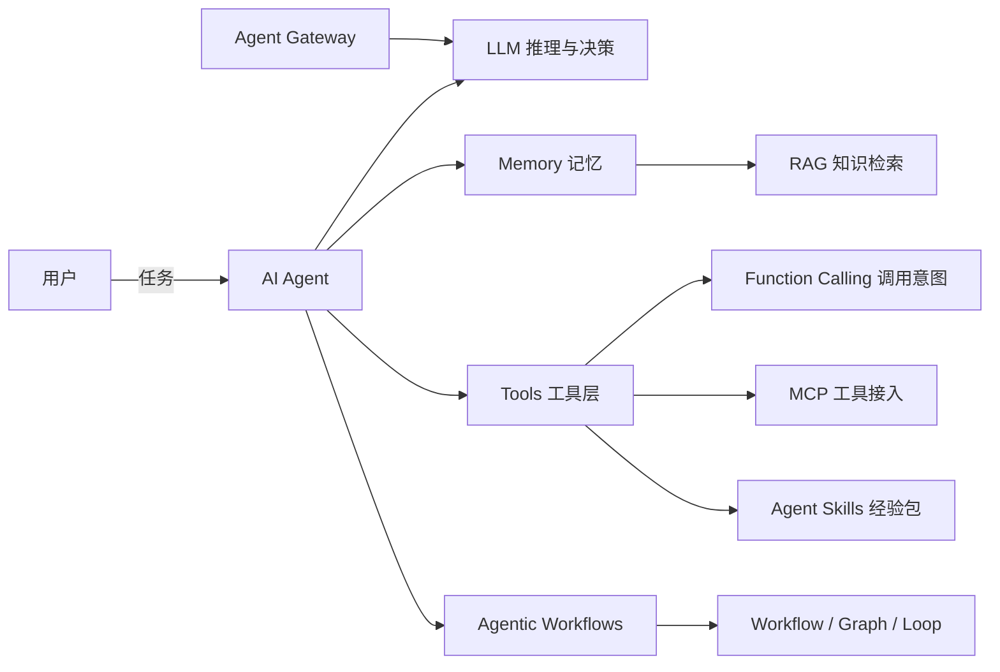

# Agent 术语表与概念边界

## 术语表

### 基础与系统

| 术语 | 一句话定义 | 容易混淆的点 |
| --- | --- | --- |
| AI Agent | 能感知环境、制定计划、调用工具、执行动作并在反馈中持续运行的软件系统 | 不是所有接 LLM 的应用都是 Agent |
| Agent Loop | Agent 的核心运行循环：读取上下文 → LLM 推理 → 调用工具 → 观察结果 → 继续，直到完成或触发停止条件 | Loop 是机制，ReAct 是使用 Loop 的一种范式 |
| Chatbot | 以对话为主要交互形式、通常不主动调用外部工具改变外部世界的应用 | 有对话界面不等于有 Agent |
| Workflow | 预先定义节点与边的固定执行流程，LLM 只作为其中若干节点 | 控制权在图结构里，不在模型手里 |
| Agentic Workflow | 全局用 Workflow 管住结构，局部不确定节点嵌入 Agent 子循环的混合形态 | 不是“纯 Agent” |
| RAG | 检索增强生成：从外部知识源检索相关片段，再交给 LLM 生成回答 | RAG 是知识接入方式，不是记忆系统的全部 |
| LLM | 大语言模型，负责理解与生成 | 不是系统本身 |
| Function Calling | 模型输出结构化“调用意图”，由外部程序决定是否执行并返回结果的机制 | 模型只生成意图，不直接执行函数 |
| Tool | 让 LLM 影响外部世界的可执行能力：查库、发信、跑代码等 | Tool 是能力，Function Calling 是调用协议 |
| Tools 注册 | 把工具名、JSON Schema、用途和禁用场景描述注入上下文的工程动作 | description 质量决定调用准确率 |
| JSON Schema | 结构化描述参数类型、必填项与约束的契约 | 它是数据格式，不是通信协议 |
| Structured Outputs | 模型按给定 Schema 输出结构化结果的约束能力 | 它约束输出，不约束执行 |
| MCP | Model Context Protocol：基于 JSON-RPC 2.0 的工具/资源/提示词接入协议 | MCP 解决“怎么接入”，Function Calling 解决“怎么表达调用意图” |
| Agent Skills | 以 SKILL.md 为核心的可复用经验包，延迟加载完整指令 | Skills 是白盒经验包，Toolkit 是黑盒高阶函数 |
| Prompt Engineering | 通过改写提示词直接影响模型输出的工程方法 | 只解决“单次怎么问” |

### 能力与工程

| 术语 | 一句话定义 | 容易混淆的点 |
| --- | --- | --- |
| Context Engineering | 管理模型在每轮决策时看到什么信息的系统方法，包括系统提示词、记忆、工具描述、检索内容的动态组装 | 解决“每轮该喂什么” |
| Harness Engineering | 围绕模型外部的执行环境做工程：循环、工具、权限、上下文、可观测、错误处理 | 瓶颈常在 Harness，不在模型 |
| Memory | Agent 保存和检索历史与经验的能力，分短期/长期 | Memory 是“记住了什么”，RAG 是“去外部查什么” |
| Short-Term Memory | 当前任务范围内的对话与执行轨迹，通常放上下文 | 超出上下文即开始失真 |
| Long-Term Memory | 跨任务持久化的用户偏好、事实和经验 | 需要检索、更新、遗忘机制 |
| Planning | 把目标拆成步骤并动态调整的能力 | 计划不是写死的流程 |
| ReAct | 推理与行动交替进行的范式 | 适合路径不确定的任务 |
| Plan-and-Execute | 先全局计划、再分步执行的范式 | 适合长任务但动态调整弱 |
| Reflection | 让模型对结果进行审查和迭代改进的机制 | 不改模型权重 |
| Multi-Agent | 多个 Agent 分工协作完成任务的架构 | 通信和调试成本远高于单 Agent |
| A2A | Agent 间通信的结构化接口约定，传递带 Schema 的任务、状态与验收信息 | 不是“让 Agent 用自然语言聊天” |
| Graph | 由 Node、Edge、State 组成的工作流数据结构 | Workflow 是思想，Graph 是表达 |
| Loop | Graph 中允许回溯和重试的回边 | 必须配终止条件和成本上限 |
| LLM Gateway | 统一接入、路由、降级、限流、成本统计、审计的模型调用基础设施 | 不只是反向代理 |

## 四组关键边界

### 1. Agent / Chatbot / Workflow / RAG

| 维度 | Chatbot | Workflow | Agent | RAG |
| --- | --- | --- | --- | --- |
| 核心问题 | 怎么把话说好 | 流程是否按图执行 | 下一步该做什么 | 去哪里找相关知识 |
| 控制权 | 模型直接回复 | 图结构预定义 | 模型动态决策 | 检索器 + 模型 |
| 外部动作 | 通常无 | 固定节点执行 | 按需调用工具 | 只读检索为主 |
| 失败模式 | 答错话 | 节点/边设计错误 | 死循环、乱调工具、目标漂移 | 召回差、上下文污染 |
| 典型产品 | 客服 FAQ 机器人 | 文章审核流水线 | 故障排查 Agent | 企业知识库问答 |

一句话边界：**Chatbot 重对话，Workflow 重流程，Agent 重自主决策，RAG 重知识接入**；四者可以组合，但不能互相替代。

### 2. Function Calling / MCP / HTTP API / Skills

| 层 | 解决什么 | 类比 |
| --- | --- | --- |
| JSON Schema | 参数“长什么样” | 接口的字段定义 |
| Function Calling | 模型“想调什么、参数是什么” | 调用请求的生成协议 |
| HTTP API | 服务之间“怎么传输” | REST 接口 |
| MCP | AI 应用与工具之间“怎么发现和接入” | USB-C 统一接口 |
| Agent Skills | 一类任务“怎么做、何时做” | 团队经验包 / SOP |

判断口诀：**模型生成的是调用意图，系统决定是否执行；MCP 管接入，Skills 管经验。**

### 3. Memory / RAG / Context

| 概念 | 回答的问题 | 生命周期 |
| --- | --- | --- |
| Context | 这一轮模型能看到什么 | 单次调用 |
| Short-Term Memory | 这个任务刚才发生了什么 | 当前任务 |
| Long-Term Memory | 过去积累了什么偏好与经验 | 跨任务持久化 |
| RAG | 外部知识库里有什么相关材料 | 按需检索 |

长期记忆可以借用 RAG 技术实现，但长期记忆还包括偏好、任务轨迹、经验教训的写入与演化；RAG 本身不做记忆演化。

### 4. Workflow / Graph / Loop / Agentic Workflow

- Workflow 是“固定流程”的抽象；
- Graph 是 Workflow 的数据结构表达：Node 执行、Edge 控制流、State 共享上下文；
- Loop 是 Graph 中的回边，用于重试、回溯、迭代；
- Agentic Workflow 是“固定骨架 + 局部自主”的组合。

## 概念关系图

## FAQ

**Q1：接了一个搜索工具的 Chatbot 是不是 Agent？**
如果每轮路径由代码写死、LLM 不决定“下一步做什么”，更接近 Workflow；只有当 LLM 能根据环境反馈持续决策并行动时，才算 Agent。

**Q2：RAG 是不是长期记忆？**
不是。RAG 是“查知识”，长期记忆还包括“记住偏好、经验、失败教训并更新”。RAG 只是长期记忆的一种实现手段。

**Q3：MCP 和 Function Calling 是不是二选一？**
不是。Function Calling 表达模型调用意图，MCP 标准化工具接入与发现。一个 MCP Server 暴露的工具，仍需用 JSON Schema 描述参数。

**Q4：有了 Agent Skills 还需要 Tool 吗？**
需要。Skills 组织经验与流程，Tool 提供原子能力；Skills 内部通常会调用 Tool。

**Q5：Multi-Agent 一定比单 Agent 强吗？**
不一定。多 Agent 带来并行与专业化，但通信、调试、成本会明显上升。先证明单 Agent 无法满足，再上多 Agent。

## 使用约定

1. 写文档时优先使用本术语表定义；出现新术语先补充到术语表再使用。
2. 架构图、设计文档中的“Agent”不得同时混用 Chatbot 与 Workflow 含义。
3. 涉及协议时明确写全称：MCP、A2A、JSON Schema，不自行造词。
4. 术语变更必须同步更新 `知识地图总索引.md` 中对应节点。

## 相关文档

- [AI Agent 核心概念](../02-Agent/01-Agent核心概念.md)：Agent Loop、范式、MCP/A2A/Skills
- [AI Agent 记忆系统](../02-Agent/02-Agent记忆系统.md)：Memory 与 RAG 的详细区别
- [大模型结构化输出](../01-LLM基础/02-大模型结构化输出.md)：JSON Schema 与 Function Calling 落地
- [Agent 自主性分级](02-Agent自主性分级.md)：从规则自动化到全自主的等级划分
