# Loop Engineering 是什么？为什么说它是新瓶装旧酒？

## Loop Engineering 到底是什么？

如果用一句话概括，可以这么理解：

**Loop Engineering 是围绕 Agent 设计可持续运行的反馈循环，让它在明确目标、工具、上下文、验证信号和停止条件下反复行动，直到任务完成、失败或需要人工接管。**

落到工程上，主要看这些点：

- 触发：谁来启动这轮任务？手动命令、定时任务、CI 失败、PR 创建、Issue 更新，还是某个消息事件。
- 目标：什么状态算完成？全部测试通过、CI green、覆盖率达到某个数值、页面截图对齐设计稿，还是只生成待人工确认的草稿。
- 上下文：Agent 每轮要看哪些文件、规则、历史状态、工具结果和项目约定。
- 行动：Agent 能改代码、跑测试、查 GitHub、读日志、发 PR，还是只能输出建议。
- 观察：它怎么知道刚才那一步做对了？测试输出、lint、类型检查、截图、审查评论、日志摘要都可以是观察结果。
- 状态：这轮试过什么、失败在哪里、下一步做什么，要写到外部文件、Issue、Linear 卡片或数据库里，不能只靠当前对话记住。
- 停止：什么时候退出，什么时候转人工，什么时候因为预算或轮次耗尽直接停。

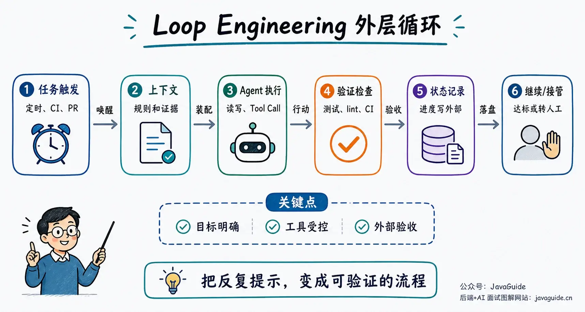

常见表述是“停止提示 Agent，开始写提示 Agent 的系统”。该说法便于传播，但忽略了 Prompt：Loop 里的每次模型调用仍依赖 Prompt、上下文和工具描述。区别在于，工程重点转移到 Prompt 之外：谁来触发、带哪些材料、跑完后用什么证据判断。

变化明显，但核心概念不新。

## 它借了哪些老概念？

Loop Engineering 由多个已有概念融合而成。

### Agent Loop / ReAct：内层循环早就存在

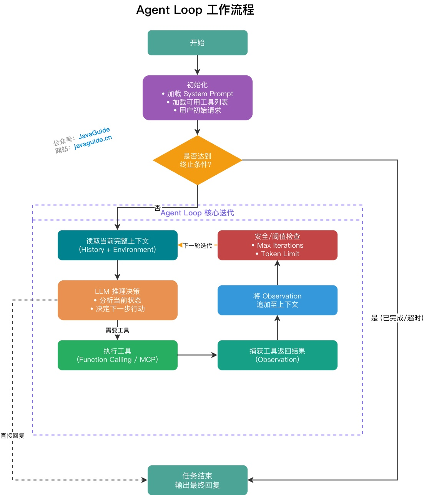

Agent Loop 很早就有了。一个最简单的 Agent 本来就是：

1. 读取当前上下文。
2. 让 LLM 判断下一步。
3. 调用工具或输出答案。
4. 把工具结果写回上下文。
5. 继续下一轮，直到触发停止条件。

ReAct 也是这个思路：Reasoning 和 Acting 交替进行，模型走一步看一步，拿到外部反馈后再决定下一步。

Agent Loop 适合路径不确定、需要根据证据调整方向的任务，如线上故障排查、代码库阅读、测试失败排查。

以下讨论外层 Loop：隔一段时间启动 Agent、分配工作、检查结果、保存状态，并决定下一轮是否继续。内层是 Agent 每一轮“推理、行动、观察”的循环。

| 层级 | 谁在循环 | 每轮做什么 | 典型停止条件 |
| --- | --- | --- | --- |
| 内层 Agent Loop | Agent 自己 | 思考、调用工具、观察结果、继续下一步 | 不再需要工具，返回最终结果 |
| 外层 Engineering Loop | 调度系统或人写的流程 | 唤醒 Agent、分配任务、验证结果、记录状态 | 达成目标、超预算、失败转人工 |

### Workflow / Graph / Loop：可控回边早就有

在工作流图里，Loop 就是回边。

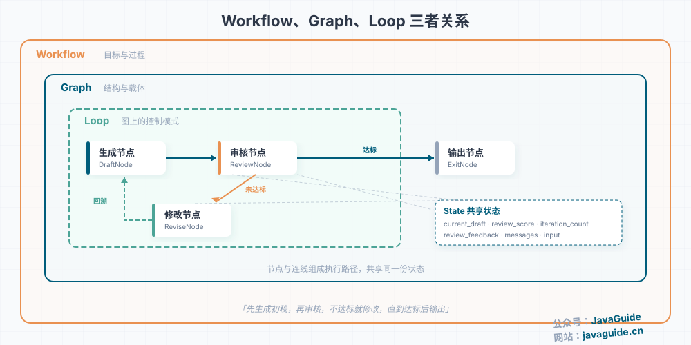

比如“生成初稿 → 审核 → 不通过就修改 → 再审核”，这本来就是 Graph 里的条件边和回边。可靠的 Loop 至少要写清三件事：

- 继续条件：为什么还要再跑一轮。
- 退出条件：什么结果算可以停。
- 安全边界：最大轮次、超时、Token 预算、失败后怎么降级。

Loop Engineering 将该思路用于代码 Agent 的日常工作。此前循环通常写在 LangGraph 或 Spring AI Alibaba Graph 中；现在循环跨过 Claude Code、Codex、CI、GitHub、Issue 系统和本地仓库。

### Context Engineering：每一轮该给 Agent 看什么

Loop 一旦跑久，上下文问题很快就会冒出来。

一次对话里上下文塞多了，模型会变慢、变飘、漏掉中间信息。一个无人值守的 Loop 跑半天，情况只会更严重：工具输出越来越多，失败记录越来越多，旧结论和新结论混在一起，Agent 可能越跑越不像在解决问题。

所以，做 Loop 基本绕不开 Context Engineering。

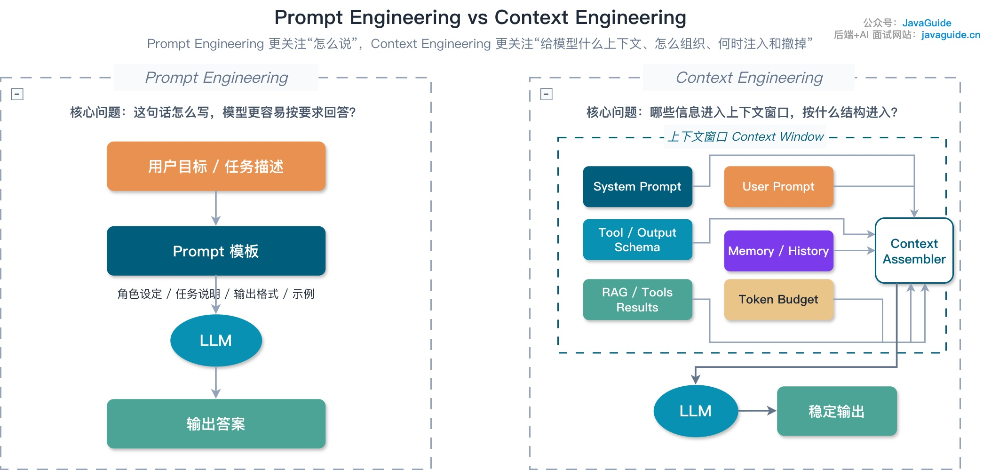

每一轮 LLM 调用前，都要重新决定该塞哪些材料：

- 哪些项目规则常驻，比如 `AGENTS.md`、`CLAUDE.md`、编码规范。
- 哪些内容按需加载，比如相关文件、测试输出、Issue 描述、设计文档。
- 哪些工具结果要摘要，哪些必须保留原始引用，比如 traceId、错误码、日志路径。
- 上下文快满时，是压缩历史、清理旧工具结果，还是把进度写进外部状态文件。

上下文管理不到位时，Loop 会高频消耗 Token：Agent 每轮重新读项目、重新猜规则、重新解释错误，最终退化为高成本重复。

### Harness Engineering：模型外面的执行环境

Harness Engineering 的定义是 Agent = Model + Harness。模型负责推理和生成，Harness 负责环境、工具、反馈、沙箱、权限、观测和恢复。

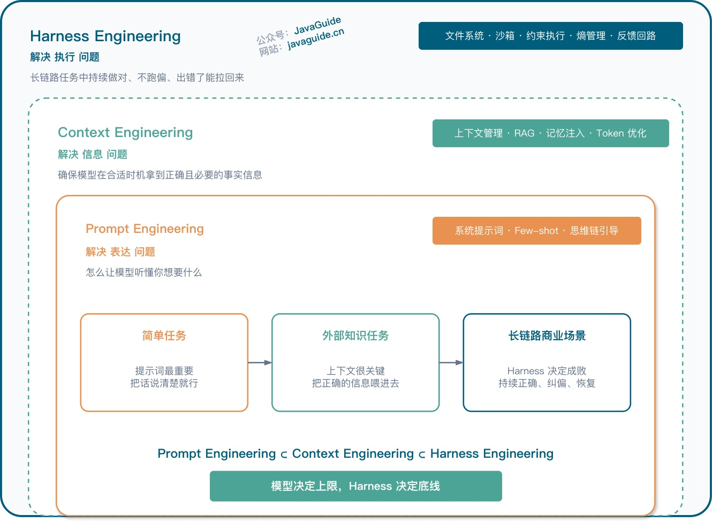

放到这套说法里，Loop Engineering 更像 Harness 外面的一层调度。Harness 解决一次任务怎么稳定执行；Loop 解决这套执行环境什么时候再启动、状态放在哪里、任务要不要分给多个 Agent。

如果 Harness 没做好，Loop 也跑不稳。Agent 不知道能不能改文件，不知道怎么验证，不知道失败后该重试还是停止，也不知道哪些操作必须等人确认。

### Skills：把每轮都要重复解释的经验写下来

Skills 这块很容易被低估。

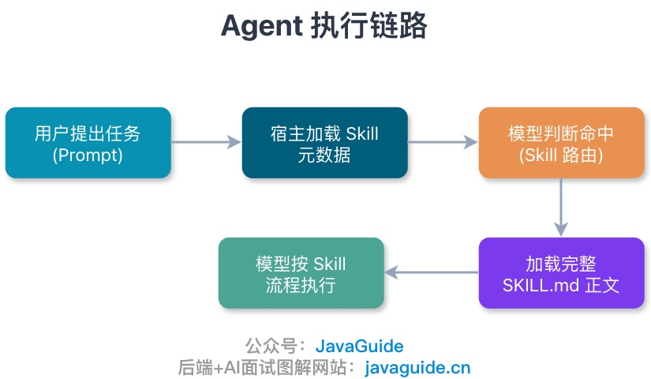

每天早上自动 Loop 处理 CI 失败时，不能每次都从零开始理解项目：

- 这个仓库怎么跑测试？
- 哪些目录不能乱改？
- 生成代码后要跑哪些格式化命令？
- PR 描述按什么模板写？
- 碰到数据库迁移要不要先问人？

这些东西全靠 Prompt 现写，成本很高，也不稳定。更合适的做法是写成 Skill：用 `description` 做路由，用 `SKILL.md` 写流程、边界、命令和失败处理。Agent 命中任务时再加载正文，不需要每轮都把规则重新塞进上下文。

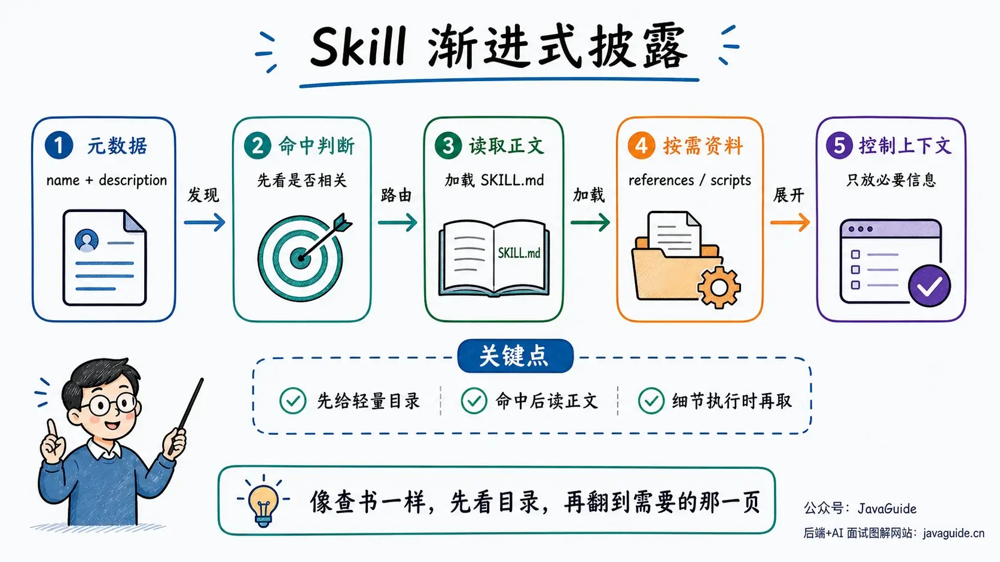

通过 Skills，Loop 无需每次重新学习项目。

### MCP：让 Loop 能接触真实工具

一个只能读写本地文件的 Loop，能做的事情比较有限。实际能派上用场的 Loop，往往要查 GitHub、看 CI、读 Sentry、操作 Linear、访问数据库、发 Slack 消息。

这些能力如果全靠每个 Agent 平台单独适配，维护成本会很高。MCP 处理的就是工具接入碎片化问题。

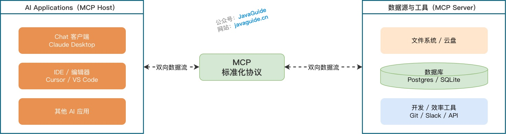

MCP 不负责让模型变聪明，它负责让工具以统一方式被发现和调用。GitHub、Issue 系统、日志平台、内部文档、数据库这些连接器，都可以通过 MCP Server 暴露出来。

同时引入风险：无人值守的 Loop 拿到过大的写权限，可能改错数据、发错消息、重复调用昂贵接口，甚至被提示词注入诱导去读不该读的文件。MCP 接进 Loop 之后，权限、审计、限流、脱敏和人工确认都要补上。

## 那它到底新在哪？

循环本身没什么新意。TDD 有循环，CI 有循环，ReAct 有循环，工作流图里也有循环。

该主题被单独提出，主要因为“谁来提示 Agent”已成为工程问题。

过去关注单句 Prompt 的写法；现在还需明确：Prompt 由谁生成、何时生成、携带哪些上下文、完成后用什么证据验收。

以前的代码 Agent 使用方式通常是这样：

1. 向 Agent 说明目标。
2. Agent 修改代码。
3. 运行测试。
4. 测试失败后，把报错贴回给 Agent。
5. Agent 继续修改。
6. 检查 diff，判断是否继续。

这中间有不少动作很机械：读错误、定位文件、重跑测试、更新待办、生成 PR 摘要。Loop Engineering 想处理的就是这部分重复劳动：

- 定时发现工作。
- 自动创建独立工作区。
- 调用项目 Skill。
- 让实现 Agent 处理。
- 让验证 Agent 检查。
- 写状态。
- 该继续就继续，该转人工就转人工。

难点在循环边界：哪些步骤能自动化，哪些步骤必须停下来让人看。


## Claude Code 的 /loop、/goal 可以怎么理解？

`/loop` 和 `/goal` 都与 Loop Engineering 有关，但用法差别明显。

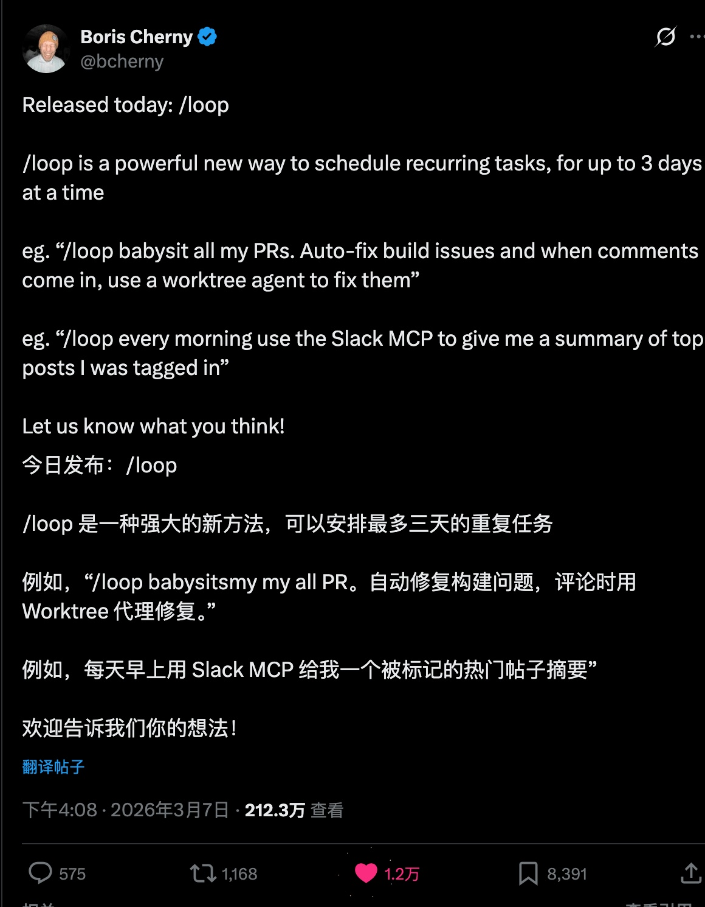

`/loop` 主要解决“过一会儿再看一次”的问题：在当前 session 中重复运行一个 prompt。可设置固定间隔（如每 5 分钟检查一次部署），也可不设间隔，让 Claude 根据观察结果选择下一次等待时长。

裸 `/loop` 会运行内置 maintenance prompt，或者读取 `.claude/loop.md`、`~/.claude/loop.md` 作为默认 prompt。

```bash
/loop 5m "检查部署是否完成，并汇报当前状态"
/loop 30m /code-review
/loop "检查 PR 的 CI 和 review comments，有变化就处理，没有变化就延后"
```

`/goal` 主要解决“目标是否完成”的问题：给定可验证完成条件，Claude 逐轮推进；每轮结束后，由独立小模型基于对话中已出现的证据判断条件是否满足。不满足就继续，满足就停止。

```bash
/goal auth 模块所有单元测试通过，并且 npm test -- tests/auth 退出码为 0；最多 5 轮，连续 2 次失败原因相同就停止并汇报
/goal src/legacy 下组件迁移完成，npm run build 通过，且 git diff 只包含 src/legacy 和对应测试文件
```

区分方式：`/loop` 管下一次何时启动，`/goal` 管何时算完成。

Stop hook 或 Agent SDK 里的控制循环会再往前走一步。每轮结束后，用脚本、Prompt 或外部 evaluator 决定要不要继续。团队里做自动化时，通常更需要这类东西：确定性检查、权限拦截、状态落盘，都不能只交给模型口头判断。

“直到测试通过、最多尝试 5 次”这类任务，放在 `/goal` 里更顺；`/loop` 更适合部署轮询、PR babysit、长构建检查、定时 code review 这类“隔一段时间再看一次”的任务。

不过 `/loop` 也有限制。它更像 session-scoped 的临时调度：任务只在 Claude Code 运行且空闲时触发；关闭终端、会话退出、新开会话都会影响它；`--resume` 或 `--continue` 只能恢复未过期的任务；循环任务最多 7 天自动过期。

任务必须跨机器、跨重启、长期稳定运行时，还是应该考虑 Routines、Desktop scheduled tasks、GitHub Actions、CI/CD 或自己的任务调度系统。

使用建议：跑 `/loop` 前收紧权限，写清轮询目标和停止条件；跑 `/goal` 前把完成条件写成可验证结果，并要求 Claude 展示测试、构建或 diff 检查结果。

关键路径先 commit，再让 Agent 自动改，方便回滚。

## Loop 可以分成几类？

把 `/loop` 和 `/goal` 分开后，Loop Engineering 会好理解很多。它覆盖的是一组循环模式，不只是某一个命令。

| 类型 | 触发方式 | 适合任务 | 代表工具 |
| --- | --- | --- | --- |
| 时间驱动 Loop | 每 N 分钟、每天、每周 | PR babysit、CI 检查、日志巡检 | `/loop`、Codex Automations、cron |
| 事件驱动 Loop | CI 失败、Issue 创建、PR 更新 | 故障分拣、评论处理、告警摘要 | GitHub Actions、Webhook、Claude Code Channels |
| 目标驱动 Loop | 上一轮结束后检查目标是否满足 | 修测试、迁移 API、补覆盖率 | `/goal`、Stop hook、Agent SDK |
| 人工审批 Loop | 关键动作前停下来确认 | 高风险改动、发布、权限变更 | approval gate、draft PR、review queue |

这张表也解释了“新瓶装旧酒”：触发、调度、验证、审批这些工程动作都不新，只是重新围绕代码 Agent 组织。

## 一个可落地的 Loop 长什么样？

下面这个例子按常见 CI 排查流程整理，不对应某家公司公开出来的完整实战案例。

假设目标是“每天自动处理 CI 失败”。第一版不要让 Agent 自动修代码，更不要自动合并，先做 triage。

第一版只看三件事：Agent 能不能找到正确证据，能不能区分事实和猜测，能不能按统一格式记录状态。这三件事都稳定了，再给它低风险修复权限。

第一版采用保守范围：

1. 触发器：每天上午 9 点启动，或者 CI 失败后触发。
2. 输入：读取最近一次 CI 失败、相关 PR、最近提交、失败测试日志。
3. 上下文：加载项目 `AGENTS.md` 和 `ci-triage` Skill，只读取相关模块文件。
4. 行动：分析失败原因，判断是环境抖动、测试不稳定、代码回归，还是依赖问题。
5. 验证：如果能在本地复现，就跑最小测试集；不能复现就保留证据。
6. 状态：把结论写入 `TODO.md`、GitHub Issue 或 Linear 卡片。
7. 输出：生成一份简短报告，标记“可自动修复”“需要负责人确认”“疑似偶发”。
8. 停止：不直接推送代码，不改生产配置，不连续重试超过 3 次。

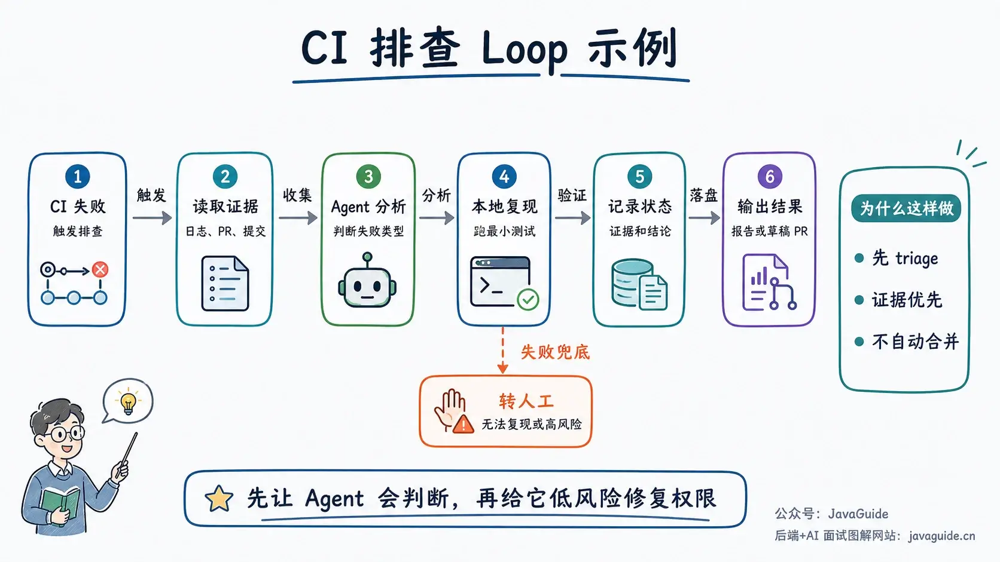

等这个版本稳定之后，再逐步加自动修复：

- 对“依赖版本冲突”“格式化失败”“明显的测试快照更新”这类低风险问题，可以开独立 worktree 让 Agent 尝试修。
- 修完后必须跑目标测试。
- 通过后只创建 PR，不自动合并。
- 另一个审查 Agent 根据项目 Skill 和 diff 做二次检查。
- 失败或不确定时回到人工队列。

该 Loop 用到以下部件：

| 部件 | 在这个例子里做什么 |
| --- | --- |
| Automation | 每天或 CI 失败时启动 |
| Skill | 固化 CI 排查流程、测试命令、仓库规则 |
| MCP / Connector | 读取 GitHub、CI、Issue、日志平台 |
| Context Engineering | 只加载失败相关日志、文件和规则 |
| Worktree | 隔离自动修复分支，避免污染主工作区 |
| Sub-agent | 一个负责实现，一个负责验证 |
| Memory / State | 记录已尝试方案、失败原因和下一步 |
| Stop Condition | 测试通过、达到重试上限、遇到高风险操作 |

“每天 9 点运行”只是触发器。支撑这个 Loop 的，是每一步的外部证据：CI 链接、失败日志、最小复现命令、测试结果、PR diff、人工确认状态。没有这些证据，Loop 只是自动重复 Prompt。

价值不在“Agent 会写代码”本身。模型、上下文和工具决定代码写得怎么样；Loop 负责把反馈、记录和停止条件放进流程里。

## 什么场景值得做 Loop？

判断标准有三点：任务是否重复，验收信号是否硬性，失败后能否回滚。

比较适合的场景：

- CI 失败初步排查：有日志、有测试结果、有明确失败信号。
- 依赖升级：可以在独立分支里改，靠测试和构建验证。
- 测试覆盖率补齐：目标可以量化，比如某模块覆盖率从 62% 提到 75%。
- 文档同步：根据最近 diff 更新用户文档或 API 文档，最后走人工 review。
- 大规模机械迁移：例如 CommonJS 到 ESM、旧组件 API 替换、格式化修复。
- PR / Issue 分拣：读信息、归类、补充摘要、标记优先级。

不太适合的场景：

- 目标很虚，比如“让产品体验更好”“想一个增长策略”。
- 验证信号弱，仅依赖 Agent 自评。
- 一旦做错影响很大，比如生产数据库写操作、权限系统变更、支付链路改造。
- 强依赖人的审美和业务判断，比如品牌文案定调、复杂产品取舍。
- 没有测试、没有日志、没有回滚方式的老项目大改。

验收标准不明确时，不要急于启用 loop。先拆小目标，写清验收标准。

## 最容易踩的坑

### 目标写得太虚

Loop 最怕“继续优化一下”这种指令。它会努力优化，但不知道该在哪里停。

不好的写法：

```
/goal "优化这个项目，让代码质量更好"
```

更稳的写法：

```
/goal "auth 模块失败的单元测试全部通过，只允许修改 src/auth 和 tests/auth；每轮修改后运行 npm test -- tests/auth 并展示退出码；最多 5 轮；如果连续 2 次失败原因相同，停止并汇报"
```

后者虽然长，但范围、验证命令、轮次上限、失败退出条件都写出来了。Agent 不需要猜。

### 把 Agent 自评当验收

让写代码的 Agent 自己判断“是否完成”，风险很高。它会倾向于相信自己的方案。

更稳的做法是 maker-checker 分离：一个 Agent 实现，另一个 Agent 审查；或者用更硬的信号，比如测试、类型检查、lint、截图对比、人工审批。越接近生产，越不能只靠自然语言自评。

可靠的 Loop 要靠外部信号兜底：测试退出码、CI 状态、lint、类型检查、截图对比、人工审批或独立评审 Agent。

### 忘了成本上限

Loop 会放大 Token 消耗。一次任务里，Agent 会读文件、跑工具、解释报错、压缩上下文、调用子 Agent、再让审查 Agent 看一遍。循环次数一多，账单增长明显。

预算也要写进设计里：

- 最大迭代次数。
- 最大工具调用次数。
- 单日或单任务 Token / 金额预算。
- 无进展检测，比如两轮失败原因相同就停。
- 低价值任务只做摘要，不自动修复。

预算控制属于架构约束，不是成本抠门。

### 权限给得太大

Loop 自主运行时，权限不能像手动会话一样随意授予。

本地文件、数据库、GitHub、Slack、CI、内部工单系统，全都要分清只读和写操作。读日志和开 PR 是两回事，开 PR 和自动合并又是两回事。删除文件、改生产配置、发外部消息、写数据库，这些最好默认需要人工确认。

MCP Server 也要审核来源和工具描述。工具 description、返回内容、Prompt 模板都可能携带注入内容，别把“能接入”当成“能放心接入”。

权限最好分级给，不要一步到位给写权限。

| 阶段 | Agent 能做什么 | 人负责什么 |
| --- | --- | --- |
| L0 只读摘要 | 读日志、读 Issue、生成报告 | 判断是否采纳 |
| L1 本地复现 | 运行指定测试、定位失败 | 决定是否修复 |
| L2 草稿修复 | 在 worktree 里改代码、跑测试 | Review diff |
| L3 创建 PR | 提交分支、写 PR 描述 | 审查、合并 |
| L4 自动合并 | 通过策略后自动合并 | 只处理异常 |

绝大多数团队先做到 L1/L2 就有价值。L4 应放到最后：问题类型固定、测试能兜住、回滚顺手时才考虑。涉及业务判断、权限、数据写入时，不急于自动合并。

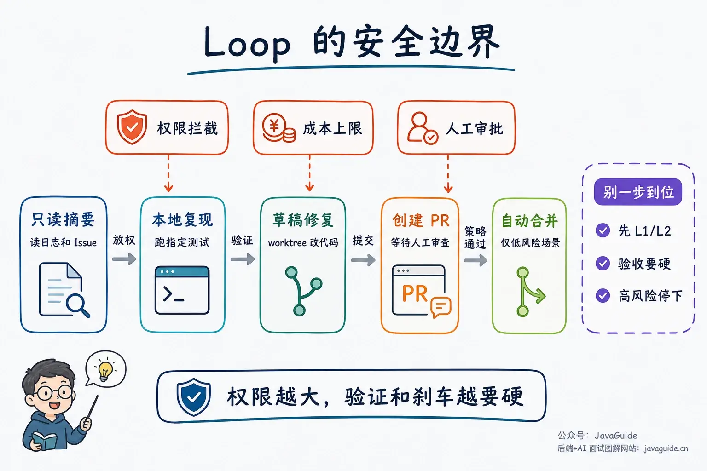

## 第一版先别急着自动修

第一次做 Loop，不要直接上无人值守自动修复，从只读 triage 开始。

第一版可以写得啰嗦一点，像这样放进 Skill 或任务描述里：

```
任务：每天看最近 24 小时的 CI 失败，产出排查摘要，供人处理。

允许做：
- 读 GitHub Actions、最近提交、失败测试日志，以及和报错直接相关的文件。
- 定位到具体测试时，可以跑对应测试确认是否复现。
- 把结论写进 TODO.md，带上 CI 链接、关键错误和建议负责人。

开始前：
- 先读取 AGENTS.md。
- 命中 CI 排查任务时加载 ci-triage Skill。

不允许做：
- 不改代码，不创建 PR，不发 Slack/邮件。
- 不读取整仓无关文件，不粘贴完整日志。
- 超过 10 个失败项就停；单个失败最多复现 2 次。
- 权限不足、日志缺失、需要业务判断时，直接标记人工处理。
```

这个版本不花哨，但胜在稳定：它不会乱改代码，也便于观察 Agent 是否误读日志、乱找文件或重复调用工具。等它的 triage 稳了，再考虑给低风险修复权限。

如果这个 Loop 要跨天运行，还需要一份外部状态。不要指望下一轮对话还能完整记住前一天试过什么。最小状态文件不用复杂，能让人和 Agent 都看懂就行：

```yaml
loop_id: ci-triage-2026-06-17
goal: "排查最近 24 小时 CI 失败"
status: running
scope:
  repos: ["backend-service"]
  max_items: 10
attempts:
  - item: "auth-test failure"
    evidence: "GitHub Actions run #12345"
    action: "ran npm test -- tests/auth"
    result: "reproduced locally"
next_step: "ask auth owner to review"
stop_condition:
  max_attempts: 3
  require_human_when:
    ["permission_missing", "production_change", "uncertain_root_cause"]
```

这个文件可以是 Markdown、YAML、Issue comment、Linear 卡片或数据库记录。格式不限，关键是不要只存在聊天记录里。

启用自动修复时，再补四条：

- 修改前创建独立 worktree 或分支。
- 修改范围白名单。
- 只允许跑指定测试和格式化命令。
- 通过后只开草稿 PR，不自动合并。

## 总结

Loop Engineering 有包装成分，但融合了多个既有概念：Agent Loop、ReAct、Workflow Graph、Context Engineering、Harness、Skills、MCP、Memory、CI、测试、代码审查。

其核心变化是：Agent 能连续读文件、改代码、跑测试、开 PR 之后，工程师不能只盯着下一句 Prompt，还要设计它能在哪些边界里自己推进。

这里面最重要的是目标、工具、上下文、验证和刹车。刹车没写好，Loop 会更快地制造混乱；刹车写好了，它才有机会把重复劳动接过去。
