# AI Agent 知识总索引（三语言版 v0.6）

> 本文件是知识库的**最外层索引**：脑图负责导航，文档负责承载内容，状态标识负责暴露缺口，语言矩阵负责三语言直达。
> 由 `build_knowledge_map.py` 生成；修改结构请改脚本后重新生成，避免图与文档漂移。

## 0. 图例与语言策略

| 标识 | 含义 |
| --- | --- |
| 🟢 | 完整：有理论+方法+实践/案例 |
| 🟡 | 部分：有内容，但深度或闭环不足 |
| 🔴 | 空白：需要补全 |
| ⚪ | 暂不建设 |
| 🧭 | 入口/导航 |
| ≡ | 三语言内容一致：Java 为 canonical，Python / TypeScript 为同路径副本，索引表中三列均可直达 |
| Java / Python / TypeScript 实现 | 同一主题有 4 篇语言化代码文档，在地图中显式展开为三个语言叶子 |

**语言组织原则**：知识地图按“知识主题”组织，不按语言复制整棵树。每个节点的语言策略只有三类：`shared` 三语言同文、`code` 三语言实现、`single` 仓库级资源。

## 1. 思维导图总图

```mermaid
mindmap
  root((AI Agent 知识总索引))
    00 阅读入口
      按角色阅读
        🟡 新手入门 ≡
        🟡 后端工程师 ≡
        🟡 算法工程师 ≡
        🟡 架构师 ≡
        🟢 面试冲刺 ≡
      按生命周期
        🟢 概念入门 ≡
        🟢 系统开发 ≡
        🟡 评测上线 ≡
        🟡 运营治理 ≡
      按语言阅读
        Java 版
          🟢 Java 全部文档
          🟢 Java PDF 版
        Python 版
          🟢 Python 全部文档
          🟢 Python PDF 版
        TypeScript 版
          🟢 TypeScript 全部文档
          🟢 TypeScript PDF 版
    🟡 01 概念与分类 ≡
      🟡 Agent 定义与边界 ≡
        🟢 Agent 是什么 ≡
        🟡 Agent vs Chatbot ≡
        🟢 Agent vs Workflow ≡
        🟡 Agent vs RAG ≡
      🟢 自主性分级 ≡
      🟡 分类体系与范式 ≡
        🟢 ReAct ≡
        🟢 Plan-and-Execute ≡
        🟡 Reflection ≡
        🟡 Multi-Agent ≡
        🟢 Agentic Workflows ≡
        🟡 A2A 协议 ≡
        🟢 各范式选型 ≡
      🟢 术语表 ≡
    🟡 02 能力模型 ≡
      🟡 感知与输入 ≡
        🟡 多模态 Token 化 ≡
        🟢 上下文窗口边界 ≡
      🟢 记忆系统 ≡
        🟢 短期记忆 ≡
        🟢 长期记忆 ≡
        🟢 记忆生命周期 ≡
        🟢 记忆检索优化 ≡
        🟢 Markdown 记忆 ≡
      🟡 规划与决策 ≡
        🟢 任务分解 ≡
        🟡 反思与自评 ≡
        🟡 成本约束决策 ≡
      🟢 工具使用与行动 ≡
        🟢 Function Calling ≡
        🟢 Tools 注册与 Schema ≡
        🟡 MCP 工具接入 ≡
        🟡 Agent Skills ≡
      🟡 协作与沟通 ≡
        🟢 多智能体协作 ≡
        🟡 A2A 通信 ≡
    🟡 03 架构与运行机制 ≡
      🟢 单 Agent 运行循环 ≡
        🟢 Agent Loop ≡
        🟢 最小三层架构 ≡
      🟡 上下文与提示词架构 ≡
        🟢 Prompt Engineering ≡
        🟢 Context Engineering ≡
        🟢 上下文利用 40% 现象 ≡
      🟢 工作流编排 ≡
        🟢 Workflow ≡
        🟢 Graph ≡
        🟢 Loop ≡
        🟢 框架概念对照 ≡
        Workflow 三语言实现
          🟢 Workflow 三语言实现 · Java 实现
          🟢 Workflow 三语言实现 · Python 实现
          🟢 Workflow 三语言实现 · TypeScript 实现
      🟢 模型接入层 ≡
        🟢 LLM 运行机制 ≡
        结构化输出
          🟢 结构化输出 · Java 实现
          🟢 结构化输出 · Python 实现
          🟢 结构化输出 · TypeScript 实现
        🟢 大模型网关 ≡
        🟢 路由与 Fallback ≡
      🟢 检索架构 RAG ≡
        🟢 RAG 基础 ≡
        🟢 Embedding ≡
        🟢 向量索引算法 ≡
        🟢 向量数据库选型 ≡
        🟢 混合检索与 RRF ≡
        🟢 Rerank 精排 ≡
        🟢 查询改写 ≡
        🟡 GraphRAG ≡
        三语言检索实现
          🟢 三语言检索实现 · Java 实现
          🟢 三语言检索实现 · Python 实现
          🟢 三语言检索实现 · TypeScript 实现
      🟢 Harness 工程 ≡
        🟢 六层架构 ≡
        🟢 一线团队案例 ≡
      🟢 多智能体编排 ≡
        🟢 编排模式 ≡
        🟡 通信协议 ≡
    🟡 04 开发与工程化 ≡
      🟡 技术选型与框架 ≡
        🟢 Java 技术栈
        🟢 Python 技术栈
        🟢 TypeScript 技术栈
        🟢 框架与平台对比 ≡
      🟢 设计模式与范式 ≡
        🟢 Workflow Graph Loop ≡
        🟢 Loop Engineering ≡
        🟢 Harness Engineering ≡
      🟢 上下文工程 ≡
        🟢 Prompt 版本化 ≡
        🟢 RAG 与 Memory 边界 ≡
        🟢 Token 预算与上下文压缩 ≡
        三语言上下文组装器
          🟢 三语言上下文组装器 · Java 实现
          🟢 三语言上下文组装器 · Python 实现
          🟢 三语言上下文组装器 · TypeScript 实现
      🟢 成本与性能优化 ≡
        🟢 成本归因 ≡
        🟢 模型分级与缓存 ≡
        🟢 限流与并发 ≡
        三语言成本限流示例
          🟢 三语言成本限流示例 · Java 实现
          🟢 三语言成本限流示例 · Python 实现
          🟢 三语言成本限流示例 · TypeScript 实现
      🟢 系统设计 ≡
        🟢 生产级分层架构 ≡
        🟢 同步 流式 异步模式 ≡
        🟢 工具调用与权限模型 ≡
        系统设计三语言接口实现
          🟢 系统设计三语言接口实现 · Java 实现
          🟢 系统设计三语言接口实现 · Python 实现
          🟢 系统设计三语言接口实现 · TypeScript 实现
      🟢 网关与基础设施 ≡
        🟢 多模型统一接入 ≡
        🟢 限流与配额 ≡
        🟢 成本统计与预算 ≡
        🟡 缓存与语义缓存 ≡
        网关三语言实现
          🟢 网关三语言实现 · Java 实现
          🟢 网关三语言实现 · Python 实现
          🟢 网关三语言实现 · TypeScript 实现
      🟢 部署与发布 ≡
        🟢 部署形态 ≡
        🟢 版本与回滚 ≡
        🟡 容量与扩展 ≡
        三语言部署示例
          🟢 三语言部署示例 · Java 实现
          🟢 三语言部署示例 · Python 实现
          🟢 三语言部署示例 · TypeScript 实现
      🟢 可观测与调试 ≡
        🟢 Trace 记录 ≡
        🟢 日志与回放 ≡
        🟡 调试工具链 ≡
        三语言采集器
          🟢 三语言采集器 · Java 实现
          🟢 三语言采集器 · Python 实现
          🟢 三语言采集器 · TypeScript 实现
    🟡 05 评测与质量 ≡
      🟢 指标体系 ≡
        🟢 任务成功率 ≡
        🟢 轨迹质量 ≡
        🟢 工具调用准确率 ≡
        🟢 延迟与成本 ≡
      🟡 评测方法 ≡
        🟢 离线评测集 ≡
        🟢 人工评测 ≡
        🟡 在线 A B 实验 ≡
        🟢 LLM-as-Judge ≡
        三语言评测脚本
          🟢 三语言评测脚本 · Java 实现
          🟢 三语言评测脚本 · Python 实现
          🟢 三语言评测脚本 · TypeScript 实现
      🟡 评测基座与回归 ≡
        🟢 评测集构建 ≡
        🔴 基准与榜单
        🟢 回归与 CI ≡
      🟡 持续改进 ≡
        🟡 Human-in-the-Loop ≡
        🟢 反馈闭环 ≡
    🟡 06 安全与治理 ≡
      🟢 风险分类 ≡
        🟢 模型风险 ≡
        🟢 工具风险 ≡
        🟢 数据风险 ≡
      🟡 护栏机制 ≡
        🟢 权限最小化 ≡
        🟡 沙箱执行 ≡
        🟢 Prompt 注入防护 ≡
        🟡 内容安全 ≡
        三语言工具风控实现
          🟢 三语言工具风控实现 · Java 实现
          🟢 三语言工具风控实现 · Python 实现
          🟢 三语言工具风控实现 · TypeScript 实现
      🟡 合规与审计 ≡
        🟡 隐私与数据边界 ≡
        🟢 审计日志 ≡
        🟡 第三方模型数据边界 ≡
      🟡 责任与流程 ≡
        🟢 审批流程 ≡
        🟡 责任归属 ≡
    🟡 07 应用与案例 ≡
      🟡 选型决策 ≡
        🟡 是否用 Agent 决策树 ≡
        🟢 Workflow vs Agent ≡
      🟡 场景模式库 ≡
        🟡 编码 Agent ≡
        🔴 客服 Agent
        🔴 数据分析 Agent
        🔴 办公自动化 Agent
      🟢 行业解决方案 ≡
        🟢 金融 ≡
        🟢 医疗 ≡
        🟢 电商 ≡
        🟢 企业服务 ≡
      🟢 案例库 ≡
        🟢 案例索引 ≡
        🟢 可复用模式 ≡
        🟢 OpenAI 三人团队 ≡
        🟢 Anthropic 三智能体 ≡
        🟢 Stripe 每周 1300 PR ≡
        🟢 失败案例与反模式 ≡
    🟡 08 生态与前沿 ≡
      🟡 协议与标准 ≡
        🟢 MCP 标准 ≡
        🟡 A2A 标准 ≡
        🟢 Skills 标准 ≡
      🟢 技术雷达 ≡
        🟢 论文清单 ≡
        🟢 框架动态 ≡
        🟢 产品平台动态 ≡
      🟡 趋势判断 ≡
        🟢 Harness 趋势 ≡
        🟡 多智能体趋势 ≡
        🟢 评测与治理趋势 ≡
```

> 同一个脑图还提供：`Agent知识地图.xmind`（XMind 直接打开）、`Agent知识地图.mm`（FreeMind / XMind 导入）、`知识地图总索引.mmd`（Mermaid 源码）。

## 2. 可点击索引（三语言链接）

约定：Java 为 canonical；所有存在的语言副本均给出直接链接；`code` 类文档已在脑图中展开为三个实现节点。

| 节点路径 | 状态 | Java | Python | TypeScript |
| --- | --- | --- | --- | --- |
| AI Agent 知识总索引 / 00 阅读入口 / 按角色阅读 / 新手入门 | 🟡 部分：有内容，但深度或闭环不足 | [Java](markdown/java/README.md) | [Python](markdown/python/README.md) | [TypeScript](markdown/typescript/README.md) |
| AI Agent 知识总索引 / 00 阅读入口 / 按角色阅读 / 后端工程师 | 🟡 部分：有内容，但深度或闭环不足 | [Java](markdown/java/README.md) | [Python](markdown/python/README.md) | [TypeScript](markdown/typescript/README.md) |
| AI Agent 知识总索引 / 00 阅读入口 / 按角色阅读 / 算法工程师 | 🟡 部分：有内容，但深度或闭环不足 | [Java](markdown/java/02-Agent/01-Agent核心概念.md) | [Python](markdown/python/02-Agent/01-Agent核心概念.md) | [TypeScript](markdown/typescript/02-Agent/01-Agent核心概念.md) |
| AI Agent 知识总索引 / 00 阅读入口 / 按角色阅读 / 架构师 | 🟡 部分：有内容，但深度或闭环不足 | [Java](markdown/java/07-系统设计/01-AI应用系统设计.md) | [Python](markdown/python/07-系统设计/01-AI应用系统设计.md) | [TypeScript](markdown/typescript/07-系统设计/01-AI应用系统设计.md) |
| AI Agent 知识总索引 / 00 阅读入口 / 按角色阅读 / 面试冲刺 | 🟢 完整：有理论+方法+实践/案例 | [Java](markdown/java/10-面试/04-AI应用开发面试指南.md) | [Python](markdown/python/10-面试/04-AI应用开发面试指南.md) | [TypeScript](markdown/typescript/10-面试/04-AI应用开发面试指南.md) |
| AI Agent 知识总索引 / 00 阅读入口 / 按生命周期 / 概念入门 | 🟢 完整：有理论+方法+实践/案例 | [Java](markdown/java/README.md) | [Python](markdown/python/README.md) | [TypeScript](markdown/typescript/README.md) |
| AI Agent 知识总索引 / 00 阅读入口 / 按生命周期 / 系统开发 | 🟢 完整：有理论+方法+实践/案例 | [Java](markdown/java/04-工程实践/01-Workflow-Graph与Loop.md) | [Python](markdown/python/04-工程实践/01-Workflow-Graph与Loop.md) | [TypeScript](markdown/typescript/04-工程实践/01-Workflow-Graph与Loop.md) |
| AI Agent 知识总索引 / 00 阅读入口 / 按生命周期 / 评测上线 | 🟡 部分：有内容，但深度或闭环不足 | [Java](markdown/java/07-系统设计/01-AI应用系统设计.md) | [Python](markdown/python/07-系统设计/01-AI应用系统设计.md) | [TypeScript](markdown/typescript/07-系统设计/01-AI应用系统设计.md) |
| AI Agent 知识总索引 / 00 阅读入口 / 按生命周期 / 运营治理 | 🟡 部分：有内容，但深度或闭环不足 | [Java](markdown/java/04-工程实践/04-大模型网关.md) | [Python](markdown/python/04-工程实践/04-大模型网关.md) | [TypeScript](markdown/typescript/04-工程实践/04-大模型网关.md) |
| AI Agent 知识总索引 / 00 阅读入口 / 按语言阅读 / Java 版 / Java 全部文档 | 🟢 完整：有理论+方法+实践/案例 | [Java](markdown/java/README.md) | — | — |
| AI Agent 知识总索引 / 00 阅读入口 / 按语言阅读 / Java 版 / Java PDF 版 | 🟢 完整：有理论+方法+实践/案例 | [Java](pdf/java) | — | — |
| AI Agent 知识总索引 / 00 阅读入口 / 按语言阅读 / Python 版 / Python 全部文档 | 🟢 完整：有理论+方法+实践/案例 | — | [Python](markdown/python/README.md) | — |
| AI Agent 知识总索引 / 00 阅读入口 / 按语言阅读 / Python 版 / Python PDF 版 | 🟢 完整：有理论+方法+实践/案例 | — | [Python](pdf/python) | — |
| AI Agent 知识总索引 / 00 阅读入口 / 按语言阅读 / TypeScript 版 / TypeScript 全部文档 | 🟢 完整：有理论+方法+实践/案例 | — | — | [TypeScript](markdown/typescript/README.md) |
| AI Agent 知识总索引 / 00 阅读入口 / 按语言阅读 / TypeScript 版 / TypeScript PDF 版 | 🟢 完整：有理论+方法+实践/案例 | — | — | [TypeScript](pdf/typescript) |
| AI Agent 知识总索引 / 01 概念与分类 / Agent 定义与边界 / Agent 是什么 | 🟢 完整：有理论+方法+实践/案例 | [Java](markdown/java/02-Agent/01-Agent核心概念.md) | [Python](markdown/python/02-Agent/01-Agent核心概念.md) | [TypeScript](markdown/typescript/02-Agent/01-Agent核心概念.md) |
| AI Agent 知识总索引 / 01 概念与分类 / Agent 定义与边界 / Agent vs Chatbot | 🟡 部分：有内容，但深度或闭环不足 | [Java](markdown/java/10-面试/06-模拟面试题库.md) | [Python](markdown/python/10-面试/06-模拟面试题库.md) | [TypeScript](markdown/typescript/10-面试/06-模拟面试题库.md) |
| AI Agent 知识总索引 / 01 概念与分类 / Agent 定义与边界 / Agent vs Workflow | 🟢 完整：有理论+方法+实践/案例 | [Java](markdown/java/02-Agent/01-Agent核心概念.md) | [Python](markdown/python/02-Agent/01-Agent核心概念.md) | [TypeScript](markdown/typescript/02-Agent/01-Agent核心概念.md) |
| AI Agent 知识总索引 / 01 概念与分类 / Agent 定义与边界 / Agent vs RAG | 🟡 部分：有内容，但深度或闭环不足 | [Java](markdown/java/02-Agent/02-Agent记忆系统.md) | [Python](markdown/python/02-Agent/02-Agent记忆系统.md) | [TypeScript](markdown/typescript/02-Agent/02-Agent记忆系统.md) |
| AI Agent 知识总索引 / 01 概念与分类 / 自主性分级 | 🟢 完整：有理论+方法+实践/案例 | [Java](markdown/java/00-概念与术语/02-Agent自主性分级.md) | [Python](markdown/python/00-概念与术语/02-Agent自主性分级.md) | [TypeScript](markdown/typescript/00-概念与术语/02-Agent自主性分级.md) |
| AI Agent 知识总索引 / 01 概念与分类 / 分类体系与范式 / ReAct | 🟢 完整：有理论+方法+实践/案例 | [Java](markdown/java/02-Agent/01-Agent核心概念.md) | [Python](markdown/python/02-Agent/01-Agent核心概念.md) | [TypeScript](markdown/typescript/02-Agent/01-Agent核心概念.md) |
| AI Agent 知识总索引 / 01 概念与分类 / 分类体系与范式 / Plan-and-Execute | 🟢 完整：有理论+方法+实践/案例 | [Java](markdown/java/02-Agent/01-Agent核心概念.md) | [Python](markdown/python/02-Agent/01-Agent核心概念.md) | [TypeScript](markdown/typescript/02-Agent/01-Agent核心概念.md) |
| AI Agent 知识总索引 / 01 概念与分类 / 分类体系与范式 / Reflection | 🟡 部分：有内容，但深度或闭环不足 | [Java](markdown/java/02-Agent/01-Agent核心概念.md) | [Python](markdown/python/02-Agent/01-Agent核心概念.md) | [TypeScript](markdown/typescript/02-Agent/01-Agent核心概念.md) |
| AI Agent 知识总索引 / 01 概念与分类 / 分类体系与范式 / Multi-Agent | 🟡 部分：有内容，但深度或闭环不足 | [Java](markdown/java/02-Agent/01-Agent核心概念.md) | [Python](markdown/python/02-Agent/01-Agent核心概念.md) | [TypeScript](markdown/typescript/02-Agent/01-Agent核心概念.md) |
| AI Agent 知识总索引 / 01 概念与分类 / 分类体系与范式 / Agentic Workflows | 🟢 完整：有理论+方法+实践/案例 | [Java](markdown/java/02-Agent/01-Agent核心概念.md) | [Python](markdown/python/02-Agent/01-Agent核心概念.md) | [TypeScript](markdown/typescript/02-Agent/01-Agent核心概念.md) |
| AI Agent 知识总索引 / 01 概念与分类 / 分类体系与范式 / A2A 协议 | 🟡 部分：有内容，但深度或闭环不足 | [Java](markdown/java/02-Agent/01-Agent核心概念.md) | [Python](markdown/python/02-Agent/01-Agent核心概念.md) | [TypeScript](markdown/typescript/02-Agent/01-Agent核心概念.md) |
| AI Agent 知识总索引 / 01 概念与分类 / 分类体系与范式 / 各范式选型 | 🟢 完整：有理论+方法+实践/案例 | [Java](markdown/java/02-Agent/01-Agent核心概念.md) | [Python](markdown/python/02-Agent/01-Agent核心概念.md) | [TypeScript](markdown/typescript/02-Agent/01-Agent核心概念.md) |
| AI Agent 知识总索引 / 01 概念与分类 / 术语表 | 🟢 完整：有理论+方法+实践/案例 | [Java](markdown/java/00-概念与术语/01-Agent术语表与概念边界.md) | [Python](markdown/python/00-概念与术语/01-Agent术语表与概念边界.md) | [TypeScript](markdown/typescript/00-概念与术语/01-Agent术语表与概念边界.md) |
| AI Agent 知识总索引 / 02 能力模型 / 感知与输入 / 多模态 Token 化 | 🟡 部分：有内容，但深度或闭环不足 | [Java](markdown/java/01-LLM基础/01-LLM运行机制.md) | [Python](markdown/python/01-LLM基础/01-LLM运行机制.md) | [TypeScript](markdown/typescript/01-LLM基础/01-LLM运行机制.md) |
| AI Agent 知识总索引 / 02 能力模型 / 感知与输入 / 上下文窗口边界 | 🟢 完整：有理论+方法+实践/案例 | [Java](markdown/java/01-LLM基础/01-LLM运行机制.md) | [Python](markdown/python/01-LLM基础/01-LLM运行机制.md) | [TypeScript](markdown/typescript/01-LLM基础/01-LLM运行机制.md) |
| AI Agent 知识总索引 / 02 能力模型 / 记忆系统 / 短期记忆 | 🟢 完整：有理论+方法+实践/案例 | [Java](markdown/java/02-Agent/02-Agent记忆系统.md) | [Python](markdown/python/02-Agent/02-Agent记忆系统.md) | [TypeScript](markdown/typescript/02-Agent/02-Agent记忆系统.md) |
| AI Agent 知识总索引 / 02 能力模型 / 记忆系统 / 长期记忆 | 🟢 完整：有理论+方法+实践/案例 | [Java](markdown/java/02-Agent/02-Agent记忆系统.md) | [Python](markdown/python/02-Agent/02-Agent记忆系统.md) | [TypeScript](markdown/typescript/02-Agent/02-Agent记忆系统.md) |
| AI Agent 知识总索引 / 02 能力模型 / 记忆系统 / 记忆生命周期 | 🟢 完整：有理论+方法+实践/案例 | [Java](markdown/java/02-Agent/02-Agent记忆系统.md) | [Python](markdown/python/02-Agent/02-Agent记忆系统.md) | [TypeScript](markdown/typescript/02-Agent/02-Agent记忆系统.md) |
| AI Agent 知识总索引 / 02 能力模型 / 记忆系统 / 记忆检索优化 | 🟢 完整：有理论+方法+实践/案例 | [Java](markdown/java/02-Agent/02-Agent记忆系统.md) | [Python](markdown/python/02-Agent/02-Agent记忆系统.md) | [TypeScript](markdown/typescript/02-Agent/02-Agent记忆系统.md) |
| AI Agent 知识总索引 / 02 能力模型 / 记忆系统 / Markdown 记忆 | 🟢 完整：有理论+方法+实践/案例 | [Java](markdown/java/02-Agent/02-Agent记忆系统.md) | [Python](markdown/python/02-Agent/02-Agent记忆系统.md) | [TypeScript](markdown/typescript/02-Agent/02-Agent记忆系统.md) |
| AI Agent 知识总索引 / 02 能力模型 / 规划与决策 / 任务分解 | 🟢 完整：有理论+方法+实践/案例 | [Java](markdown/java/02-Agent/01-Agent核心概念.md) | [Python](markdown/python/02-Agent/01-Agent核心概念.md) | [TypeScript](markdown/typescript/02-Agent/01-Agent核心概念.md) |
| AI Agent 知识总索引 / 02 能力模型 / 规划与决策 / 反思与自评 | 🟡 部分：有内容，但深度或闭环不足 | [Java](markdown/java/02-Agent/01-Agent核心概念.md) | [Python](markdown/python/02-Agent/01-Agent核心概念.md) | [TypeScript](markdown/typescript/02-Agent/01-Agent核心概念.md) |
| AI Agent 知识总索引 / 02 能力模型 / 规划与决策 / 成本约束决策 | 🟡 部分：有内容，但深度或闭环不足 | [Java](markdown/java/04-工程实践/02-Loop工程.md) | [Python](markdown/python/04-工程实践/02-Loop工程.md) | [TypeScript](markdown/typescript/04-工程实践/02-Loop工程.md) |
| AI Agent 知识总索引 / 02 能力模型 / 工具使用与行动 / Function Calling | 🟢 完整：有理论+方法+实践/案例 | [Java](markdown/java/01-LLM基础/02-大模型结构化输出.md) | [Python](markdown/python/01-LLM基础/02-大模型结构化输出.md) | [TypeScript](markdown/typescript/01-LLM基础/02-大模型结构化输出.md) |
| AI Agent 知识总索引 / 02 能力模型 / 工具使用与行动 / Tools 注册与 Schema | 🟢 完整：有理论+方法+实践/案例 | [Java](markdown/java/02-Agent/01-Agent核心概念.md) | [Python](markdown/python/02-Agent/01-Agent核心概念.md) | [TypeScript](markdown/typescript/02-Agent/01-Agent核心概念.md) |
| AI Agent 知识总索引 / 02 能力模型 / 工具使用与行动 / MCP 工具接入 | 🟡 部分：有内容，但深度或闭环不足 | [Java](markdown/java/02-Agent/01-Agent核心概念.md) | [Python](markdown/python/02-Agent/01-Agent核心概念.md) | [TypeScript](markdown/typescript/02-Agent/01-Agent核心概念.md) |
| AI Agent 知识总索引 / 02 能力模型 / 工具使用与行动 / Agent Skills | 🟡 部分：有内容，但深度或闭环不足 | [Java](markdown/java/02-Agent/01-Agent核心概念.md) | [Python](markdown/python/02-Agent/01-Agent核心概念.md) | [TypeScript](markdown/typescript/02-Agent/01-Agent核心概念.md) |
| AI Agent 知识总索引 / 02 能力模型 / 协作与沟通 / 多智能体协作 | 🟢 完整：有理论+方法+实践/案例 | [Java](markdown/java/02-Agent/03-多智能体编排.md) | [Python](markdown/python/02-Agent/03-多智能体编排.md) | [TypeScript](markdown/typescript/02-Agent/03-多智能体编排.md) |
| AI Agent 知识总索引 / 02 能力模型 / 协作与沟通 / A2A 通信 | 🟡 部分：有内容，但深度或闭环不足 | [Java](markdown/java/02-Agent/01-Agent核心概念.md) | [Python](markdown/python/02-Agent/01-Agent核心概念.md) | [TypeScript](markdown/typescript/02-Agent/01-Agent核心概念.md) |
| AI Agent 知识总索引 / 03 架构与运行机制 / 单 Agent 运行循环 / Agent Loop | 🟢 完整：有理论+方法+实践/案例 | [Java](markdown/java/02-Agent/01-Agent核心概念.md) | [Python](markdown/python/02-Agent/01-Agent核心概念.md) | [TypeScript](markdown/typescript/02-Agent/01-Agent核心概念.md) |
| AI Agent 知识总索引 / 03 架构与运行机制 / 单 Agent 运行循环 / 最小三层架构 | 🟢 完整：有理论+方法+实践/案例 | [Java](markdown/java/02-Agent/01-Agent核心概念.md) | [Python](markdown/python/02-Agent/01-Agent核心概念.md) | [TypeScript](markdown/typescript/02-Agent/01-Agent核心概念.md) |
| AI Agent 知识总索引 / 03 架构与运行机制 / 上下文与提示词架构 / Prompt Engineering | 🟢 完整：有理论+方法+实践/案例 | [Java](markdown/java/02-Agent/01-Agent核心概念.md) | [Python](markdown/python/02-Agent/01-Agent核心概念.md) | [TypeScript](markdown/typescript/02-Agent/01-Agent核心概念.md) |
| AI Agent 知识总索引 / 03 架构与运行机制 / 上下文与提示词架构 / Context Engineering | 🟢 完整：有理论+方法+实践/案例 | [Java](markdown/java/02-Agent/01-Agent核心概念.md) | [Python](markdown/python/02-Agent/01-Agent核心概念.md) | [TypeScript](markdown/typescript/02-Agent/01-Agent核心概念.md) |
| AI Agent 知识总索引 / 03 架构与运行机制 / 上下文与提示词架构 / 上下文利用 40% 现象 | 🟢 完整：有理论+方法+实践/案例 | [Java](markdown/java/04-工程实践/03-Harness工程.md) | [Python](markdown/python/04-工程实践/03-Harness工程.md) | [TypeScript](markdown/typescript/04-工程实践/03-Harness工程.md) |
| AI Agent 知识总索引 / 03 架构与运行机制 / 工作流编排 / Workflow | 🟢 完整：有理论+方法+实践/案例 | [Java](markdown/java/04-工程实践/01-Workflow-Graph与Loop.md) | [Python](markdown/python/04-工程实践/01-Workflow-Graph与Loop.md) | [TypeScript](markdown/typescript/04-工程实践/01-Workflow-Graph与Loop.md) |
| AI Agent 知识总索引 / 03 架构与运行机制 / 工作流编排 / Graph | 🟢 完整：有理论+方法+实践/案例 | [Java](markdown/java/04-工程实践/01-Workflow-Graph与Loop.md) | [Python](markdown/python/04-工程实践/01-Workflow-Graph与Loop.md) | [TypeScript](markdown/typescript/04-工程实践/01-Workflow-Graph与Loop.md) |
| AI Agent 知识总索引 / 03 架构与运行机制 / 工作流编排 / Loop | 🟢 完整：有理论+方法+实践/案例 | [Java](markdown/java/04-工程实践/01-Workflow-Graph与Loop.md) | [Python](markdown/python/04-工程实践/01-Workflow-Graph与Loop.md) | [TypeScript](markdown/typescript/04-工程实践/01-Workflow-Graph与Loop.md) |
| AI Agent 知识总索引 / 03 架构与运行机制 / 工作流编排 / 框架概念对照 | 🟢 完整：有理论+方法+实践/案例 | [Java](markdown/java/04-工程实践/01-Workflow-Graph与Loop.md) | [Python](markdown/python/04-工程实践/01-Workflow-Graph与Loop.md) | [TypeScript](markdown/typescript/04-工程实践/01-Workflow-Graph与Loop.md) |
| AI Agent 知识总索引 / 03 架构与运行机制 / 工作流编排 / Workflow 三语言实现 / Workflow 三语言实现 · Java 实现 | 🟢 完整：有理论+方法+实践/案例 | [Java](markdown/java/04-工程实践/01-Workflow-Graph与Loop.md) | — | — |
| AI Agent 知识总索引 / 03 架构与运行机制 / 工作流编排 / Workflow 三语言实现 / Workflow 三语言实现 · Python 实现 | 🟢 完整：有理论+方法+实践/案例 | — | [Python](markdown/python/04-工程实践/01-Workflow-Graph与Loop.md) | — |
| AI Agent 知识总索引 / 03 架构与运行机制 / 工作流编排 / Workflow 三语言实现 / Workflow 三语言实现 · TypeScript 实现 | 🟢 完整：有理论+方法+实践/案例 | — | — | [TypeScript](markdown/typescript/04-工程实践/01-Workflow-Graph与Loop.md) |
| AI Agent 知识总索引 / 03 架构与运行机制 / 模型接入层 / LLM 运行机制 | 🟢 完整：有理论+方法+实践/案例 | [Java](markdown/java/01-LLM基础/01-LLM运行机制.md) | [Python](markdown/python/01-LLM基础/01-LLM运行机制.md) | [TypeScript](markdown/typescript/01-LLM基础/01-LLM运行机制.md) |
| AI Agent 知识总索引 / 03 架构与运行机制 / 模型接入层 / 结构化输出 / 结构化输出 · Java 实现 | 🟢 完整：有理论+方法+实践/案例 | [Java](markdown/java/01-LLM基础/02-大模型结构化输出.md) | — | — |
| AI Agent 知识总索引 / 03 架构与运行机制 / 模型接入层 / 结构化输出 / 结构化输出 · Python 实现 | 🟢 完整：有理论+方法+实践/案例 | — | [Python](markdown/python/01-LLM基础/02-大模型结构化输出.md) | — |
| AI Agent 知识总索引 / 03 架构与运行机制 / 模型接入层 / 结构化输出 / 结构化输出 · TypeScript 实现 | 🟢 完整：有理论+方法+实践/案例 | — | — | [TypeScript](markdown/typescript/01-LLM基础/02-大模型结构化输出.md) |
| AI Agent 知识总索引 / 03 架构与运行机制 / 模型接入层 / 大模型网关 | 🟢 完整：有理论+方法+实践/案例 | [Java](markdown/java/04-工程实践/04-大模型网关.md) | [Python](markdown/python/04-工程实践/04-大模型网关.md) | [TypeScript](markdown/typescript/04-工程实践/04-大模型网关.md) |
| AI Agent 知识总索引 / 03 架构与运行机制 / 模型接入层 / 路由与 Fallback | 🟢 完整：有理论+方法+实践/案例 | [Java](markdown/java/04-工程实践/04-大模型网关.md) | [Python](markdown/python/04-工程实践/04-大模型网关.md) | [TypeScript](markdown/typescript/04-工程实践/04-大模型网关.md) |
| AI Agent 知识总索引 / 03 架构与运行机制 / 检索架构 RAG / RAG 基础 | 🟢 完整：有理论+方法+实践/案例 | [Java](markdown/java/03-RAG/01-RAG基础概念.md) | [Python](markdown/python/03-RAG/01-RAG基础概念.md) | [TypeScript](markdown/typescript/03-RAG/01-RAG基础概念.md) |
| AI Agent 知识总索引 / 03 架构与运行机制 / 检索架构 RAG / Embedding | 🟢 完整：有理论+方法+实践/案例 | [Java](markdown/java/03-RAG/01-RAG基础概念.md) | [Python](markdown/python/03-RAG/01-RAG基础概念.md) | [TypeScript](markdown/typescript/03-RAG/01-RAG基础概念.md) |
| AI Agent 知识总索引 / 03 架构与运行机制 / 检索架构 RAG / 向量索引算法 | 🟢 完整：有理论+方法+实践/案例 | [Java](markdown/java/03-RAG/02-RAG向量索引与向量数据库.md) | [Python](markdown/python/03-RAG/02-RAG向量索引与向量数据库.md) | [TypeScript](markdown/typescript/03-RAG/02-RAG向量索引与向量数据库.md) |
| AI Agent 知识总索引 / 03 架构与运行机制 / 检索架构 RAG / 向量数据库选型 | 🟢 完整：有理论+方法+实践/案例 | [Java](markdown/java/03-RAG/02-RAG向量索引与向量数据库.md) | [Python](markdown/python/03-RAG/02-RAG向量索引与向量数据库.md) | [TypeScript](markdown/typescript/03-RAG/02-RAG向量索引与向量数据库.md) |
| AI Agent 知识总索引 / 03 架构与运行机制 / 检索架构 RAG / 混合检索与 RRF | 🟢 完整：有理论+方法+实践/案例 | [Java](markdown/java/03-RAG/03-RAG高级检索.md) | [Python](markdown/python/03-RAG/03-RAG高级检索.md) | [TypeScript](markdown/typescript/03-RAG/03-RAG高级检索.md) |
| AI Agent 知识总索引 / 03 架构与运行机制 / 检索架构 RAG / Rerank 精排 | 🟢 完整：有理论+方法+实践/案例 | [Java](markdown/java/03-RAG/03-RAG高级检索.md) | [Python](markdown/python/03-RAG/03-RAG高级检索.md) | [TypeScript](markdown/typescript/03-RAG/03-RAG高级检索.md) |
| AI Agent 知识总索引 / 03 架构与运行机制 / 检索架构 RAG / 查询改写 | 🟢 完整：有理论+方法+实践/案例 | [Java](markdown/java/03-RAG/03-RAG高级检索.md) | [Python](markdown/python/03-RAG/03-RAG高级检索.md) | [TypeScript](markdown/typescript/03-RAG/03-RAG高级检索.md) |
| AI Agent 知识总索引 / 03 架构与运行机制 / 检索架构 RAG / GraphRAG | 🟡 部分：有内容，但深度或闭环不足 | [Java](markdown/java/03-RAG/03-RAG高级检索.md) | [Python](markdown/python/03-RAG/03-RAG高级检索.md) | [TypeScript](markdown/typescript/03-RAG/03-RAG高级检索.md) |
| AI Agent 知识总索引 / 03 架构与运行机制 / 检索架构 RAG / 三语言检索实现 / 三语言检索实现 · Java 实现 | 🟢 完整：有理论+方法+实践/案例 | [Java](markdown/java/03-RAG/03-RAG高级检索.md) | — | — |
| AI Agent 知识总索引 / 03 架构与运行机制 / 检索架构 RAG / 三语言检索实现 / 三语言检索实现 · Python 实现 | 🟢 完整：有理论+方法+实践/案例 | — | [Python](markdown/python/03-RAG/03-RAG高级检索.md) | — |
| AI Agent 知识总索引 / 03 架构与运行机制 / 检索架构 RAG / 三语言检索实现 / 三语言检索实现 · TypeScript 实现 | 🟢 完整：有理论+方法+实践/案例 | — | — | [TypeScript](markdown/typescript/03-RAG/03-RAG高级检索.md) |
| AI Agent 知识总索引 / 03 架构与运行机制 / Harness 工程 / 六层架构 | 🟢 完整：有理论+方法+实践/案例 | [Java](markdown/java/04-工程实践/03-Harness工程.md) | [Python](markdown/python/04-工程实践/03-Harness工程.md) | [TypeScript](markdown/typescript/04-工程实践/03-Harness工程.md) |
| AI Agent 知识总索引 / 03 架构与运行机制 / Harness 工程 / 一线团队案例 | 🟢 完整：有理论+方法+实践/案例 | [Java](markdown/java/04-工程实践/03-Harness工程.md) | [Python](markdown/python/04-工程实践/03-Harness工程.md) | [TypeScript](markdown/typescript/04-工程实践/03-Harness工程.md) |
| AI Agent 知识总索引 / 03 架构与运行机制 / 多智能体编排 / 编排模式 | 🟢 完整：有理论+方法+实践/案例 | [Java](markdown/java/02-Agent/03-多智能体编排.md) | [Python](markdown/python/02-Agent/03-多智能体编排.md) | [TypeScript](markdown/typescript/02-Agent/03-多智能体编排.md) |
| AI Agent 知识总索引 / 03 架构与运行机制 / 多智能体编排 / 通信协议 | 🟡 部分：有内容，但深度或闭环不足 | [Java](markdown/java/02-Agent/03-多智能体编排.md) | [Python](markdown/python/02-Agent/03-多智能体编排.md) | [TypeScript](markdown/typescript/02-Agent/03-多智能体编排.md) |
| AI Agent 知识总索引 / 04 开发与工程化 / 技术选型与框架 / Java 技术栈 | 🟢 完整：有理论+方法+实践/案例 | [Java](markdown/java/README.md) | — | — |
| AI Agent 知识总索引 / 04 开发与工程化 / 技术选型与框架 / Python 技术栈 | 🟢 完整：有理论+方法+实践/案例 | — | [Python](markdown/python/README.md) | — |
| AI Agent 知识总索引 / 04 开发与工程化 / 技术选型与框架 / TypeScript 技术栈 | 🟢 完整：有理论+方法+实践/案例 | — | — | [TypeScript](markdown/typescript/README.md) |
| AI Agent 知识总索引 / 04 开发与工程化 / 技术选型与框架 / 框架与平台对比 | 🟢 完整：有理论+方法+实践/案例 | [Java](markdown/java/04-工程实践/07-Agent框架选型对比.md) | [Python](markdown/python/04-工程实践/07-Agent框架选型对比.md) | [TypeScript](markdown/typescript/04-工程实践/07-Agent框架选型对比.md) |
| AI Agent 知识总索引 / 04 开发与工程化 / 设计模式与范式 / Workflow Graph Loop | 🟢 完整：有理论+方法+实践/案例 | [Java](markdown/java/04-工程实践/01-Workflow-Graph与Loop.md) | [Python](markdown/python/04-工程实践/01-Workflow-Graph与Loop.md) | [TypeScript](markdown/typescript/04-工程实践/01-Workflow-Graph与Loop.md) |
| AI Agent 知识总索引 / 04 开发与工程化 / 设计模式与范式 / Loop Engineering | 🟢 完整：有理论+方法+实践/案例 | [Java](markdown/java/04-工程实践/02-Loop工程.md) | [Python](markdown/python/04-工程实践/02-Loop工程.md) | [TypeScript](markdown/typescript/04-工程实践/02-Loop工程.md) |
| AI Agent 知识总索引 / 04 开发与工程化 / 设计模式与范式 / Harness Engineering | 🟢 完整：有理论+方法+实践/案例 | [Java](markdown/java/04-工程实践/03-Harness工程.md) | [Python](markdown/python/04-工程实践/03-Harness工程.md) | [TypeScript](markdown/typescript/04-工程实践/03-Harness工程.md) |
| AI Agent 知识总索引 / 04 开发与工程化 / 上下文工程 / Prompt 版本化 | 🟢 完整：有理论+方法+实践/案例 | [Java](markdown/java/04-工程实践/08-上下文工程.md) | [Python](markdown/python/04-工程实践/08-上下文工程.md) | [TypeScript](markdown/typescript/04-工程实践/08-上下文工程.md) |
| AI Agent 知识总索引 / 04 开发与工程化 / 上下文工程 / RAG 与 Memory 边界 | 🟢 完整：有理论+方法+实践/案例 | [Java](markdown/java/02-Agent/02-Agent记忆系统.md) | [Python](markdown/python/02-Agent/02-Agent记忆系统.md) | [TypeScript](markdown/typescript/02-Agent/02-Agent记忆系统.md) |
| AI Agent 知识总索引 / 04 开发与工程化 / 上下文工程 / Token 预算与上下文压缩 | 🟢 完整：有理论+方法+实践/案例 | [Java](markdown/java/04-工程实践/08-上下文工程.md) | [Python](markdown/python/04-工程实践/08-上下文工程.md) | [TypeScript](markdown/typescript/04-工程实践/08-上下文工程.md) |
| AI Agent 知识总索引 / 04 开发与工程化 / 上下文工程 / 三语言上下文组装器 / 三语言上下文组装器 · Java 实现 | 🟢 完整：有理论+方法+实践/案例 | [Java](markdown/java/04-工程实践/08-上下文工程.md) | — | — |
| AI Agent 知识总索引 / 04 开发与工程化 / 上下文工程 / 三语言上下文组装器 / 三语言上下文组装器 · Python 实现 | 🟢 完整：有理论+方法+实践/案例 | — | [Python](markdown/python/04-工程实践/08-上下文工程.md) | — |
| AI Agent 知识总索引 / 04 开发与工程化 / 上下文工程 / 三语言上下文组装器 / 三语言上下文组装器 · TypeScript 实现 | 🟢 完整：有理论+方法+实践/案例 | — | — | [TypeScript](markdown/typescript/04-工程实践/08-上下文工程.md) |
| AI Agent 知识总索引 / 04 开发与工程化 / 成本与性能优化 / 成本归因 | 🟢 完整：有理论+方法+实践/案例 | [Java](markdown/java/04-工程实践/09-成本与性能优化.md) | [Python](markdown/python/04-工程实践/09-成本与性能优化.md) | [TypeScript](markdown/typescript/04-工程实践/09-成本与性能优化.md) |
| AI Agent 知识总索引 / 04 开发与工程化 / 成本与性能优化 / 模型分级与缓存 | 🟢 完整：有理论+方法+实践/案例 | [Java](markdown/java/04-工程实践/09-成本与性能优化.md) | [Python](markdown/python/04-工程实践/09-成本与性能优化.md) | [TypeScript](markdown/typescript/04-工程实践/09-成本与性能优化.md) |
| AI Agent 知识总索引 / 04 开发与工程化 / 成本与性能优化 / 限流与并发 | 🟢 完整：有理论+方法+实践/案例 | [Java](markdown/java/04-工程实践/09-成本与性能优化.md) | [Python](markdown/python/04-工程实践/09-成本与性能优化.md) | [TypeScript](markdown/typescript/04-工程实践/09-成本与性能优化.md) |
| AI Agent 知识总索引 / 04 开发与工程化 / 成本与性能优化 / 三语言成本限流示例 / 三语言成本限流示例 · Java 实现 | 🟢 完整：有理论+方法+实践/案例 | [Java](markdown/java/04-工程实践/09-成本与性能优化.md) | — | — |
| AI Agent 知识总索引 / 04 开发与工程化 / 成本与性能优化 / 三语言成本限流示例 / 三语言成本限流示例 · Python 实现 | 🟢 完整：有理论+方法+实践/案例 | — | [Python](markdown/python/04-工程实践/09-成本与性能优化.md) | — |
| AI Agent 知识总索引 / 04 开发与工程化 / 成本与性能优化 / 三语言成本限流示例 / 三语言成本限流示例 · TypeScript 实现 | 🟢 完整：有理论+方法+实践/案例 | — | — | [TypeScript](markdown/typescript/04-工程实践/09-成本与性能优化.md) |
| AI Agent 知识总索引 / 04 开发与工程化 / 系统设计 / 生产级分层架构 | 🟢 完整：有理论+方法+实践/案例 | [Java](markdown/java/07-系统设计/01-AI应用系统设计.md) | [Python](markdown/python/07-系统设计/01-AI应用系统设计.md) | [TypeScript](markdown/typescript/07-系统设计/01-AI应用系统设计.md) |
| AI Agent 知识总索引 / 04 开发与工程化 / 系统设计 / 同步 流式 异步模式 | 🟢 完整：有理论+方法+实践/案例 | [Java](markdown/java/07-系统设计/01-AI应用系统设计.md) | [Python](markdown/python/07-系统设计/01-AI应用系统设计.md) | [TypeScript](markdown/typescript/07-系统设计/01-AI应用系统设计.md) |
| AI Agent 知识总索引 / 04 开发与工程化 / 系统设计 / 工具调用与权限模型 | 🟢 完整：有理论+方法+实践/案例 | [Java](markdown/java/07-系统设计/01-AI应用系统设计.md) | [Python](markdown/python/07-系统设计/01-AI应用系统设计.md) | [TypeScript](markdown/typescript/07-系统设计/01-AI应用系统设计.md) |
| AI Agent 知识总索引 / 04 开发与工程化 / 系统设计 / 系统设计三语言接口实现 / 系统设计三语言接口实现 · Java 实现 | 🟢 完整：有理论+方法+实践/案例 | [Java](markdown/java/07-系统设计/01-AI应用系统设计.md) | — | — |
| AI Agent 知识总索引 / 04 开发与工程化 / 系统设计 / 系统设计三语言接口实现 / 系统设计三语言接口实现 · Python 实现 | 🟢 完整：有理论+方法+实践/案例 | — | [Python](markdown/python/07-系统设计/01-AI应用系统设计.md) | — |
| AI Agent 知识总索引 / 04 开发与工程化 / 系统设计 / 系统设计三语言接口实现 / 系统设计三语言接口实现 · TypeScript 实现 | 🟢 完整：有理论+方法+实践/案例 | — | — | [TypeScript](markdown/typescript/07-系统设计/01-AI应用系统设计.md) |
| AI Agent 知识总索引 / 04 开发与工程化 / 网关与基础设施 / 多模型统一接入 | 🟢 完整：有理论+方法+实践/案例 | [Java](markdown/java/04-工程实践/04-大模型网关.md) | [Python](markdown/python/04-工程实践/04-大模型网关.md) | [TypeScript](markdown/typescript/04-工程实践/04-大模型网关.md) |
| AI Agent 知识总索引 / 04 开发与工程化 / 网关与基础设施 / 限流与配额 | 🟢 完整：有理论+方法+实践/案例 | [Java](markdown/java/04-工程实践/04-大模型网关.md) | [Python](markdown/python/04-工程实践/04-大模型网关.md) | [TypeScript](markdown/typescript/04-工程实践/04-大模型网关.md) |
| AI Agent 知识总索引 / 04 开发与工程化 / 网关与基础设施 / 成本统计与预算 | 🟢 完整：有理论+方法+实践/案例 | [Java](markdown/java/04-工程实践/04-大模型网关.md) | [Python](markdown/python/04-工程实践/04-大模型网关.md) | [TypeScript](markdown/typescript/04-工程实践/04-大模型网关.md) |
| AI Agent 知识总索引 / 04 开发与工程化 / 网关与基础设施 / 缓存与语义缓存 | 🟡 部分：有内容，但深度或闭环不足 | [Java](markdown/java/04-工程实践/04-大模型网关.md) | [Python](markdown/python/04-工程实践/04-大模型网关.md) | [TypeScript](markdown/typescript/04-工程实践/04-大模型网关.md) |
| AI Agent 知识总索引 / 04 开发与工程化 / 网关与基础设施 / 网关三语言实现 / 网关三语言实现 · Java 实现 | 🟢 完整：有理论+方法+实践/案例 | [Java](markdown/java/04-工程实践/04-大模型网关.md) | — | — |
| AI Agent 知识总索引 / 04 开发与工程化 / 网关与基础设施 / 网关三语言实现 / 网关三语言实现 · Python 实现 | 🟢 完整：有理论+方法+实践/案例 | — | [Python](markdown/python/04-工程实践/04-大模型网关.md) | — |
| AI Agent 知识总索引 / 04 开发与工程化 / 网关与基础设施 / 网关三语言实现 / 网关三语言实现 · TypeScript 实现 | 🟢 完整：有理论+方法+实践/案例 | — | — | [TypeScript](markdown/typescript/04-工程实践/04-大模型网关.md) |
| AI Agent 知识总索引 / 04 开发与工程化 / 部署与发布 / 部署形态 | 🟢 完整：有理论+方法+实践/案例 | [Java](markdown/java/04-工程实践/06-Agent部署与发布.md) | [Python](markdown/python/04-工程实践/06-Agent部署与发布.md) | [TypeScript](markdown/typescript/04-工程实践/06-Agent部署与发布.md) |
| AI Agent 知识总索引 / 04 开发与工程化 / 部署与发布 / 版本与回滚 | 🟢 完整：有理论+方法+实践/案例 | [Java](markdown/java/04-工程实践/06-Agent部署与发布.md) | [Python](markdown/python/04-工程实践/06-Agent部署与发布.md) | [TypeScript](markdown/typescript/04-工程实践/06-Agent部署与发布.md) |
| AI Agent 知识总索引 / 04 开发与工程化 / 部署与发布 / 容量与扩展 | 🟡 部分：有内容，但深度或闭环不足 | [Java](markdown/java/04-工程实践/06-Agent部署与发布.md) | [Python](markdown/python/04-工程实践/06-Agent部署与发布.md) | [TypeScript](markdown/typescript/04-工程实践/06-Agent部署与发布.md) |
| AI Agent 知识总索引 / 04 开发与工程化 / 部署与发布 / 三语言部署示例 / 三语言部署示例 · Java 实现 | 🟢 完整：有理论+方法+实践/案例 | [Java](markdown/java/04-工程实践/06-Agent部署与发布.md) | — | — |
| AI Agent 知识总索引 / 04 开发与工程化 / 部署与发布 / 三语言部署示例 / 三语言部署示例 · Python 实现 | 🟢 完整：有理论+方法+实践/案例 | — | [Python](markdown/python/04-工程实践/06-Agent部署与发布.md) | — |
| AI Agent 知识总索引 / 04 开发与工程化 / 部署与发布 / 三语言部署示例 / 三语言部署示例 · TypeScript 实现 | 🟢 完整：有理论+方法+实践/案例 | — | — | [TypeScript](markdown/typescript/04-工程实践/06-Agent部署与发布.md) |
| AI Agent 知识总索引 / 04 开发与工程化 / 可观测与调试 / Trace 记录 | 🟢 完整：有理论+方法+实践/案例 | [Java](markdown/java/04-工程实践/05-Agent可观测与追踪.md) | [Python](markdown/python/04-工程实践/05-Agent可观测与追踪.md) | [TypeScript](markdown/typescript/04-工程实践/05-Agent可观测与追踪.md) |
| AI Agent 知识总索引 / 04 开发与工程化 / 可观测与调试 / 日志与回放 | 🟢 完整：有理论+方法+实践/案例 | [Java](markdown/java/04-工程实践/05-Agent可观测与追踪.md) | [Python](markdown/python/04-工程实践/05-Agent可观测与追踪.md) | [TypeScript](markdown/typescript/04-工程实践/05-Agent可观测与追踪.md) |
| AI Agent 知识总索引 / 04 开发与工程化 / 可观测与调试 / 调试工具链 | 🟡 部分：有内容，但深度或闭环不足 | [Java](markdown/java/04-工程实践/05-Agent可观测与追踪.md) | [Python](markdown/python/04-工程实践/05-Agent可观测与追踪.md) | [TypeScript](markdown/typescript/04-工程实践/05-Agent可观测与追踪.md) |
| AI Agent 知识总索引 / 04 开发与工程化 / 可观测与调试 / 三语言采集器 / 三语言采集器 · Java 实现 | 🟢 完整：有理论+方法+实践/案例 | [Java](markdown/java/04-工程实践/05-Agent可观测与追踪.md) | — | — |
| AI Agent 知识总索引 / 04 开发与工程化 / 可观测与调试 / 三语言采集器 / 三语言采集器 · Python 实现 | 🟢 完整：有理论+方法+实践/案例 | — | [Python](markdown/python/04-工程实践/05-Agent可观测与追踪.md) | — |
| AI Agent 知识总索引 / 04 开发与工程化 / 可观测与调试 / 三语言采集器 / 三语言采集器 · TypeScript 实现 | 🟢 完整：有理论+方法+实践/案例 | — | — | [TypeScript](markdown/typescript/04-工程实践/05-Agent可观测与追踪.md) |
| AI Agent 知识总索引 / 05 评测与质量 / 指标体系 / 任务成功率 | 🟢 完整：有理论+方法+实践/案例 | [Java](markdown/java/05-评测与质量/01-Agent评测体系.md) | [Python](markdown/python/05-评测与质量/01-Agent评测体系.md) | [TypeScript](markdown/typescript/05-评测与质量/01-Agent评测体系.md) |
| AI Agent 知识总索引 / 05 评测与质量 / 指标体系 / 轨迹质量 | 🟢 完整：有理论+方法+实践/案例 | [Java](markdown/java/05-评测与质量/01-Agent评测体系.md) | [Python](markdown/python/05-评测与质量/01-Agent评测体系.md) | [TypeScript](markdown/typescript/05-评测与质量/01-Agent评测体系.md) |
| AI Agent 知识总索引 / 05 评测与质量 / 指标体系 / 工具调用准确率 | 🟢 完整：有理论+方法+实践/案例 | [Java](markdown/java/05-评测与质量/01-Agent评测体系.md) | [Python](markdown/python/05-评测与质量/01-Agent评测体系.md) | [TypeScript](markdown/typescript/05-评测与质量/01-Agent评测体系.md) |
| AI Agent 知识总索引 / 05 评测与质量 / 指标体系 / 延迟与成本 | 🟢 完整：有理论+方法+实践/案例 | [Java](markdown/java/05-评测与质量/01-Agent评测体系.md) | [Python](markdown/python/05-评测与质量/01-Agent评测体系.md) | [TypeScript](markdown/typescript/05-评测与质量/01-Agent评测体系.md) |
| AI Agent 知识总索引 / 05 评测与质量 / 评测方法 / 离线评测集 | 🟢 完整：有理论+方法+实践/案例 | [Java](markdown/java/05-评测与质量/01-Agent评测体系.md) | [Python](markdown/python/05-评测与质量/01-Agent评测体系.md) | [TypeScript](markdown/typescript/05-评测与质量/01-Agent评测体系.md) |
| AI Agent 知识总索引 / 05 评测与质量 / 评测方法 / 人工评测 | 🟢 完整：有理论+方法+实践/案例 | [Java](markdown/java/05-评测与质量/01-Agent评测体系.md) | [Python](markdown/python/05-评测与质量/01-Agent评测体系.md) | [TypeScript](markdown/typescript/05-评测与质量/01-Agent评测体系.md) |
| AI Agent 知识总索引 / 05 评测与质量 / 评测方法 / 在线 A B 实验 | 🟡 部分：有内容，但深度或闭环不足 | [Java](markdown/java/05-评测与质量/01-Agent评测体系.md) | [Python](markdown/python/05-评测与质量/01-Agent评测体系.md) | [TypeScript](markdown/typescript/05-评测与质量/01-Agent评测体系.md) |
| AI Agent 知识总索引 / 05 评测与质量 / 评测方法 / LLM-as-Judge | 🟢 完整：有理论+方法+实践/案例 | [Java](markdown/java/05-评测与质量/01-Agent评测体系.md) | [Python](markdown/python/05-评测与质量/01-Agent评测体系.md) | [TypeScript](markdown/typescript/05-评测与质量/01-Agent评测体系.md) |
| AI Agent 知识总索引 / 05 评测与质量 / 评测方法 / 三语言评测脚本 / 三语言评测脚本 · Java 实现 | 🟢 完整：有理论+方法+实践/案例 | [Java](markdown/java/05-评测与质量/01-Agent评测体系.md) | — | — |
| AI Agent 知识总索引 / 05 评测与质量 / 评测方法 / 三语言评测脚本 / 三语言评测脚本 · Python 实现 | 🟢 完整：有理论+方法+实践/案例 | — | [Python](markdown/python/05-评测与质量/01-Agent评测体系.md) | — |
| AI Agent 知识总索引 / 05 评测与质量 / 评测方法 / 三语言评测脚本 / 三语言评测脚本 · TypeScript 实现 | 🟢 完整：有理论+方法+实践/案例 | — | — | [TypeScript](markdown/typescript/05-评测与质量/01-Agent评测体系.md) |
| AI Agent 知识总索引 / 05 评测与质量 / 评测基座与回归 / 评测集构建 | 🟢 完整：有理论+方法+实践/案例 | [Java](markdown/java/05-评测与质量/01-Agent评测体系.md) | [Python](markdown/python/05-评测与质量/01-Agent评测体系.md) | [TypeScript](markdown/typescript/05-评测与质量/01-Agent评测体系.md) |
| AI Agent 知识总索引 / 05 评测与质量 / 评测基座与回归 / 基准与榜单 | 🔴 空白：需要补全 | — | — | — |
| AI Agent 知识总索引 / 05 评测与质量 / 评测基座与回归 / 回归与 CI | 🟢 完整：有理论+方法+实践/案例 | [Java](markdown/java/05-评测与质量/01-Agent评测体系.md) | [Python](markdown/python/05-评测与质量/01-Agent评测体系.md) | [TypeScript](markdown/typescript/05-评测与质量/01-Agent评测体系.md) |
| AI Agent 知识总索引 / 05 评测与质量 / 持续改进 / Human-in-the-Loop | 🟡 部分：有内容，但深度或闭环不足 | [Java](markdown/java/07-系统设计/01-AI应用系统设计.md) | [Python](markdown/python/07-系统设计/01-AI应用系统设计.md) | [TypeScript](markdown/typescript/07-系统设计/01-AI应用系统设计.md) |
| AI Agent 知识总索引 / 05 评测与质量 / 持续改进 / 反馈闭环 | 🟢 完整：有理论+方法+实践/案例 | [Java](markdown/java/05-评测与质量/01-Agent评测体系.md) | [Python](markdown/python/05-评测与质量/01-Agent评测体系.md) | [TypeScript](markdown/typescript/05-评测与质量/01-Agent评测体系.md) |
| AI Agent 知识总索引 / 06 安全与治理 / 风险分类 / 模型风险 | 🟢 完整：有理论+方法+实践/案例 | [Java](markdown/java/06-安全与治理/01-Agent安全护栏清单.md) | [Python](markdown/python/06-安全与治理/01-Agent安全护栏清单.md) | [TypeScript](markdown/typescript/06-安全与治理/01-Agent安全护栏清单.md) |
| AI Agent 知识总索引 / 06 安全与治理 / 风险分类 / 工具风险 | 🟢 完整：有理论+方法+实践/案例 | [Java](markdown/java/06-安全与治理/01-Agent安全护栏清单.md) | [Python](markdown/python/06-安全与治理/01-Agent安全护栏清单.md) | [TypeScript](markdown/typescript/06-安全与治理/01-Agent安全护栏清单.md) |
| AI Agent 知识总索引 / 06 安全与治理 / 风险分类 / 数据风险 | 🟢 完整：有理论+方法+实践/案例 | [Java](markdown/java/06-安全与治理/01-Agent安全护栏清单.md) | [Python](markdown/python/06-安全与治理/01-Agent安全护栏清单.md) | [TypeScript](markdown/typescript/06-安全与治理/01-Agent安全护栏清单.md) |
| AI Agent 知识总索引 / 06 安全与治理 / 护栏机制 / 权限最小化 | 🟢 完整：有理论+方法+实践/案例 | [Java](markdown/java/06-安全与治理/01-Agent安全护栏清单.md) | [Python](markdown/python/06-安全与治理/01-Agent安全护栏清单.md) | [TypeScript](markdown/typescript/06-安全与治理/01-Agent安全护栏清单.md) |
| AI Agent 知识总索引 / 06 安全与治理 / 护栏机制 / 沙箱执行 | 🟡 部分：有内容，但深度或闭环不足 | [Java](markdown/java/06-安全与治理/01-Agent安全护栏清单.md) | [Python](markdown/python/06-安全与治理/01-Agent安全护栏清单.md) | [TypeScript](markdown/typescript/06-安全与治理/01-Agent安全护栏清单.md) |
| AI Agent 知识总索引 / 06 安全与治理 / 护栏机制 / Prompt 注入防护 | 🟢 完整：有理论+方法+实践/案例 | [Java](markdown/java/06-安全与治理/01-Agent安全护栏清单.md) | [Python](markdown/python/06-安全与治理/01-Agent安全护栏清单.md) | [TypeScript](markdown/typescript/06-安全与治理/01-Agent安全护栏清单.md) |
| AI Agent 知识总索引 / 06 安全与治理 / 护栏机制 / 内容安全 | 🟡 部分：有内容，但深度或闭环不足 | [Java](markdown/java/06-安全与治理/01-Agent安全护栏清单.md) | [Python](markdown/python/06-安全与治理/01-Agent安全护栏清单.md) | [TypeScript](markdown/typescript/06-安全与治理/01-Agent安全护栏清单.md) |
| AI Agent 知识总索引 / 06 安全与治理 / 护栏机制 / 三语言工具风控实现 / 三语言工具风控实现 · Java 实现 | 🟢 完整：有理论+方法+实践/案例 | [Java](markdown/java/06-安全与治理/01-Agent安全护栏清单.md) | — | — |
| AI Agent 知识总索引 / 06 安全与治理 / 护栏机制 / 三语言工具风控实现 / 三语言工具风控实现 · Python 实现 | 🟢 完整：有理论+方法+实践/案例 | — | [Python](markdown/python/06-安全与治理/01-Agent安全护栏清单.md) | — |
| AI Agent 知识总索引 / 06 安全与治理 / 护栏机制 / 三语言工具风控实现 / 三语言工具风控实现 · TypeScript 实现 | 🟢 完整：有理论+方法+实践/案例 | — | — | [TypeScript](markdown/typescript/06-安全与治理/01-Agent安全护栏清单.md) |
| AI Agent 知识总索引 / 06 安全与治理 / 合规与审计 / 隐私与数据边界 | 🟡 部分：有内容，但深度或闭环不足 | [Java](markdown/java/07-系统设计/01-AI应用系统设计.md) | [Python](markdown/python/07-系统设计/01-AI应用系统设计.md) | [TypeScript](markdown/typescript/07-系统设计/01-AI应用系统设计.md) |
| AI Agent 知识总索引 / 06 安全与治理 / 合规与审计 / 审计日志 | 🟢 完整：有理论+方法+实践/案例 | [Java](markdown/java/06-安全与治理/01-Agent安全护栏清单.md) | [Python](markdown/python/06-安全与治理/01-Agent安全护栏清单.md) | [TypeScript](markdown/typescript/06-安全与治理/01-Agent安全护栏清单.md) |
| AI Agent 知识总索引 / 06 安全与治理 / 合规与审计 / 第三方模型数据边界 | 🟡 部分：有内容，但深度或闭环不足 | [Java](markdown/java/07-系统设计/01-AI应用系统设计.md) | [Python](markdown/python/07-系统设计/01-AI应用系统设计.md) | [TypeScript](markdown/typescript/07-系统设计/01-AI应用系统设计.md) |
| AI Agent 知识总索引 / 06 安全与治理 / 责任与流程 / 审批流程 | 🟢 完整：有理论+方法+实践/案例 | [Java](markdown/java/06-安全与治理/01-Agent安全护栏清单.md) | [Python](markdown/python/06-安全与治理/01-Agent安全护栏清单.md) | [TypeScript](markdown/typescript/06-安全与治理/01-Agent安全护栏清单.md) |
| AI Agent 知识总索引 / 06 安全与治理 / 责任与流程 / 责任归属 | 🟡 部分：有内容，但深度或闭环不足 | [Java](markdown/java/06-安全与治理/01-Agent安全护栏清单.md) | [Python](markdown/python/06-安全与治理/01-Agent安全护栏清单.md) | [TypeScript](markdown/typescript/06-安全与治理/01-Agent安全护栏清单.md) |
| AI Agent 知识总索引 / 07 应用与案例 / 选型决策 / 是否用 Agent 决策树 | 🟡 部分：有内容，但深度或闭环不足 | [Java](markdown/java/02-Agent/01-Agent核心概念.md) | [Python](markdown/python/02-Agent/01-Agent核心概念.md) | [TypeScript](markdown/typescript/02-Agent/01-Agent核心概念.md) |
| AI Agent 知识总索引 / 07 应用与案例 / 选型决策 / Workflow vs Agent | 🟢 完整：有理论+方法+实践/案例 | [Java](markdown/java/02-Agent/01-Agent核心概念.md) | [Python](markdown/python/02-Agent/01-Agent核心概念.md) | [TypeScript](markdown/typescript/02-Agent/01-Agent核心概念.md) |
| AI Agent 知识总索引 / 07 应用与案例 / 场景模式库 / 编码 Agent | 🟡 部分：有内容，但深度或闭环不足 | [Java](markdown/java/04-工程实践/03-Harness工程.md) | [Python](markdown/python/04-工程实践/03-Harness工程.md) | [TypeScript](markdown/typescript/04-工程实践/03-Harness工程.md) |
| AI Agent 知识总索引 / 07 应用与案例 / 场景模式库 / 客服 Agent | 🔴 空白：需要补全 | — | — | — |
| AI Agent 知识总索引 / 07 应用与案例 / 场景模式库 / 数据分析 Agent | 🔴 空白：需要补全 | — | — | — |
| AI Agent 知识总索引 / 07 应用与案例 / 场景模式库 / 办公自动化 Agent | 🔴 空白：需要补全 | — | — | — |
| AI Agent 知识总索引 / 07 应用与案例 / 行业解决方案 / 金融 | 🟢 完整：有理论+方法+实践/案例 | [Java](markdown/java/08-应用与案例/02-行业场景方案.md) | [Python](markdown/python/08-应用与案例/02-行业场景方案.md) | [TypeScript](markdown/typescript/08-应用与案例/02-行业场景方案.md) |
| AI Agent 知识总索引 / 07 应用与案例 / 行业解决方案 / 医疗 | 🟢 完整：有理论+方法+实践/案例 | [Java](markdown/java/08-应用与案例/02-行业场景方案.md) | [Python](markdown/python/08-应用与案例/02-行业场景方案.md) | [TypeScript](markdown/typescript/08-应用与案例/02-行业场景方案.md) |
| AI Agent 知识总索引 / 07 应用与案例 / 行业解决方案 / 电商 | 🟢 完整：有理论+方法+实践/案例 | [Java](markdown/java/08-应用与案例/02-行业场景方案.md) | [Python](markdown/python/08-应用与案例/02-行业场景方案.md) | [TypeScript](markdown/typescript/08-应用与案例/02-行业场景方案.md) |
| AI Agent 知识总索引 / 07 应用与案例 / 行业解决方案 / 企业服务 | 🟢 完整：有理论+方法+实践/案例 | [Java](markdown/java/08-应用与案例/02-行业场景方案.md) | [Python](markdown/python/08-应用与案例/02-行业场景方案.md) | [TypeScript](markdown/typescript/08-应用与案例/02-行业场景方案.md) |
| AI Agent 知识总索引 / 07 应用与案例 / 案例库 / 案例索引 | 🟢 完整：有理论+方法+实践/案例 | [Java](markdown/java/08-应用与案例/01-案例库与反模式索引.md) | [Python](markdown/python/08-应用与案例/01-案例库与反模式索引.md) | [TypeScript](markdown/typescript/08-应用与案例/01-案例库与反模式索引.md) |
| AI Agent 知识总索引 / 07 应用与案例 / 案例库 / 可复用模式 | 🟢 完整：有理论+方法+实践/案例 | [Java](markdown/java/08-应用与案例/01-案例库与反模式索引.md) | [Python](markdown/python/08-应用与案例/01-案例库与反模式索引.md) | [TypeScript](markdown/typescript/08-应用与案例/01-案例库与反模式索引.md) |
| AI Agent 知识总索引 / 07 应用与案例 / 案例库 / OpenAI 三人团队 | 🟢 完整：有理论+方法+实践/案例 | [Java](markdown/java/04-工程实践/03-Harness工程.md) | [Python](markdown/python/04-工程实践/03-Harness工程.md) | [TypeScript](markdown/typescript/04-工程实践/03-Harness工程.md) |
| AI Agent 知识总索引 / 07 应用与案例 / 案例库 / Anthropic 三智能体 | 🟢 完整：有理论+方法+实践/案例 | [Java](markdown/java/04-工程实践/03-Harness工程.md) | [Python](markdown/python/04-工程实践/03-Harness工程.md) | [TypeScript](markdown/typescript/04-工程实践/03-Harness工程.md) |
| AI Agent 知识总索引 / 07 应用与案例 / 案例库 / Stripe 每周 1300 PR | 🟢 完整：有理论+方法+实践/案例 | [Java](markdown/java/04-工程实践/03-Harness工程.md) | [Python](markdown/python/04-工程实践/03-Harness工程.md) | [TypeScript](markdown/typescript/04-工程实践/03-Harness工程.md) |
| AI Agent 知识总索引 / 07 应用与案例 / 案例库 / 失败案例与反模式 | 🟢 完整：有理论+方法+实践/案例 | [Java](markdown/java/08-应用与案例/01-案例库与反模式索引.md) | [Python](markdown/python/08-应用与案例/01-案例库与反模式索引.md) | [TypeScript](markdown/typescript/08-应用与案例/01-案例库与反模式索引.md) |
| AI Agent 知识总索引 / 08 生态与前沿 / 协议与标准 / MCP 标准 | 🟢 完整：有理论+方法+实践/案例 | [Java](markdown/java/09-生态与前沿/01-Agent技术雷达.md) | [Python](markdown/python/09-生态与前沿/01-Agent技术雷达.md) | [TypeScript](markdown/typescript/09-生态与前沿/01-Agent技术雷达.md) |
| AI Agent 知识总索引 / 08 生态与前沿 / 协议与标准 / A2A 标准 | 🟡 部分：有内容，但深度或闭环不足 | [Java](markdown/java/09-生态与前沿/01-Agent技术雷达.md) | [Python](markdown/python/09-生态与前沿/01-Agent技术雷达.md) | [TypeScript](markdown/typescript/09-生态与前沿/01-Agent技术雷达.md) |
| AI Agent 知识总索引 / 08 生态与前沿 / 协议与标准 / Skills 标准 | 🟢 完整：有理论+方法+实践/案例 | [Java](markdown/java/09-生态与前沿/01-Agent技术雷达.md) | [Python](markdown/python/09-生态与前沿/01-Agent技术雷达.md) | [TypeScript](markdown/typescript/09-生态与前沿/01-Agent技术雷达.md) |
| AI Agent 知识总索引 / 08 生态与前沿 / 技术雷达 / 论文清单 | 🟢 完整：有理论+方法+实践/案例 | [Java](markdown/java/09-生态与前沿/02-论文精读清单.md) | [Python](markdown/python/09-生态与前沿/02-论文精读清单.md) | [TypeScript](markdown/typescript/09-生态与前沿/02-论文精读清单.md) |
| AI Agent 知识总索引 / 08 生态与前沿 / 技术雷达 / 框架动态 | 🟢 完整：有理论+方法+实践/案例 | [Java](markdown/java/09-生态与前沿/01-Agent技术雷达.md) | [Python](markdown/python/09-生态与前沿/01-Agent技术雷达.md) | [TypeScript](markdown/typescript/09-生态与前沿/01-Agent技术雷达.md) |
| AI Agent 知识总索引 / 08 生态与前沿 / 技术雷达 / 产品平台动态 | 🟢 完整：有理论+方法+实践/案例 | [Java](markdown/java/09-生态与前沿/01-Agent技术雷达.md) | [Python](markdown/python/09-生态与前沿/01-Agent技术雷达.md) | [TypeScript](markdown/typescript/09-生态与前沿/01-Agent技术雷达.md) |
| AI Agent 知识总索引 / 08 生态与前沿 / 趋势判断 / Harness 趋势 | 🟢 完整：有理论+方法+实践/案例 | [Java](markdown/java/04-工程实践/03-Harness工程.md) | [Python](markdown/python/04-工程实践/03-Harness工程.md) | [TypeScript](markdown/typescript/04-工程实践/03-Harness工程.md) |
| AI Agent 知识总索引 / 08 生态与前沿 / 趋势判断 / 多智能体趋势 | 🟡 部分：有内容，但深度或闭环不足 | [Java](markdown/java/09-生态与前沿/01-Agent技术雷达.md) | [Python](markdown/python/09-生态与前沿/01-Agent技术雷达.md) | [TypeScript](markdown/typescript/09-生态与前沿/01-Agent技术雷达.md) |
| AI Agent 知识总索引 / 08 生态与前沿 / 趋势判断 / 评测与治理趋势 | 🟢 完整：有理论+方法+实践/案例 | [Java](markdown/java/09-生态与前沿/01-Agent技术雷达.md) | [Python](markdown/python/09-生态与前沿/01-Agent技术雷达.md) | [TypeScript](markdown/typescript/09-生态与前沿/01-Agent技术雷达.md) |

## 3. 语言覆盖矩阵（20 篇 × 3 语言）

| # | 文档 | 语言策略 | Java | Python | TypeScript |
| --- | --- | --- | --- | --- | --- |
| 1 | Agent 术语表与概念边界 | shared：三语言同文 | [java](markdown/java/00-概念与术语/01-Agent术语表与概念边界.md) | [python](markdown/python/00-概念与术语/01-Agent术语表与概念边界.md) | [typescript](markdown/typescript/00-概念与术语/01-Agent术语表与概念边界.md) |
| 2 | Agent 自主性分级 | shared：三语言同文 | [java](markdown/java/00-概念与术语/02-Agent自主性分级.md) | [python](markdown/python/00-概念与术语/02-Agent自主性分级.md) | [typescript](markdown/typescript/00-概念与术语/02-Agent自主性分级.md) |
| 3 | LLM 运行机制 | shared：三语言同文 | [java](markdown/java/01-LLM基础/01-LLM运行机制.md) | [python](markdown/python/01-LLM基础/01-LLM运行机制.md) | [typescript](markdown/typescript/01-LLM基础/01-LLM运行机制.md) |
| 4 | 大模型结构化输出 | code：三套语言化实现 | [java](markdown/java/01-LLM基础/02-大模型结构化输出.md) | [python](markdown/python/01-LLM基础/02-大模型结构化输出.md) | [typescript](markdown/typescript/01-LLM基础/02-大模型结构化输出.md) |
| 5 | Agent 核心概念 | shared：三语言同文 | [java](markdown/java/02-Agent/01-Agent核心概念.md) | [python](markdown/python/02-Agent/01-Agent核心概念.md) | [typescript](markdown/typescript/02-Agent/01-Agent核心概念.md) |
| 6 | Agent 记忆系统 | shared：三语言同文 | [java](markdown/java/02-Agent/02-Agent记忆系统.md) | [python](markdown/python/02-Agent/02-Agent记忆系统.md) | [typescript](markdown/typescript/02-Agent/02-Agent记忆系统.md) |
| 7 | 多智能体编排 | shared：三语言同文 | [java](markdown/java/02-Agent/03-多智能体编排.md) | [python](markdown/python/02-Agent/03-多智能体编排.md) | [typescript](markdown/typescript/02-Agent/03-多智能体编排.md) |
| 8 | RAG 基础概念 | shared：三语言同文 | [java](markdown/java/03-RAG/01-RAG基础概念.md) | [python](markdown/python/03-RAG/01-RAG基础概念.md) | [typescript](markdown/typescript/03-RAG/01-RAG基础概念.md) |
| 9 | RAG 向量索引与向量数据库 | shared：三语言同文 | [java](markdown/java/03-RAG/02-RAG向量索引与向量数据库.md) | [python](markdown/python/03-RAG/02-RAG向量索引与向量数据库.md) | [typescript](markdown/typescript/03-RAG/02-RAG向量索引与向量数据库.md) |
| 10 | RAG 高级检索 | code：三套语言化实现 | [java](markdown/java/03-RAG/03-RAG高级检索.md) | [python](markdown/python/03-RAG/03-RAG高级检索.md) | [typescript](markdown/typescript/03-RAG/03-RAG高级检索.md) |
| 11 | Workflow、Graph 与 Loop | code：三套语言化实现 | [java](markdown/java/04-工程实践/01-Workflow-Graph与Loop.md) | [python](markdown/python/04-工程实践/01-Workflow-Graph与Loop.md) | [typescript](markdown/typescript/04-工程实践/01-Workflow-Graph与Loop.md) |
| 12 | Loop Engineering | shared：三语言同文 | [java](markdown/java/04-工程实践/02-Loop工程.md) | [python](markdown/python/04-工程实践/02-Loop工程.md) | [typescript](markdown/typescript/04-工程实践/02-Loop工程.md) |
| 13 | Harness Engineering | shared：三语言同文 | [java](markdown/java/04-工程实践/03-Harness工程.md) | [python](markdown/python/04-工程实践/03-Harness工程.md) | [typescript](markdown/typescript/04-工程实践/03-Harness工程.md) |
| 14 | 大模型网关 | code：三套语言化实现 | [java](markdown/java/04-工程实践/04-大模型网关.md) | [python](markdown/python/04-工程实践/04-大模型网关.md) | [typescript](markdown/typescript/04-工程实践/04-大模型网关.md) |
| 15 | Agent 可观测与追踪 | code：三套语言化实现 | [java](markdown/java/04-工程实践/05-Agent可观测与追踪.md) | [python](markdown/python/04-工程实践/05-Agent可观测与追踪.md) | [typescript](markdown/typescript/04-工程实践/05-Agent可观测与追踪.md) |
| 16 | Agent 部署与发布 | code：三套语言化实现 | [java](markdown/java/04-工程实践/06-Agent部署与发布.md) | [python](markdown/python/04-工程实践/06-Agent部署与发布.md) | [typescript](markdown/typescript/04-工程实践/06-Agent部署与发布.md) |
| 17 | Agent 框架选型对比 | shared：三语言同文 | [java](markdown/java/04-工程实践/07-Agent框架选型对比.md) | [python](markdown/python/04-工程实践/07-Agent框架选型对比.md) | [typescript](markdown/typescript/04-工程实践/07-Agent框架选型对比.md) |
| 18 | 上下文工程 | code：三套语言化实现 | [java](markdown/java/04-工程实践/08-上下文工程.md) | [python](markdown/python/04-工程实践/08-上下文工程.md) | [typescript](markdown/typescript/04-工程实践/08-上下文工程.md) |
| 19 | 成本与性能优化 | code：三套语言化实现 | [java](markdown/java/04-工程实践/09-成本与性能优化.md) | [python](markdown/python/04-工程实践/09-成本与性能优化.md) | [typescript](markdown/typescript/04-工程实践/09-成本与性能优化.md) |
| 20 | Agent 评测体系 | code：三套语言化实现 | [java](markdown/java/05-评测与质量/01-Agent评测体系.md) | [python](markdown/python/05-评测与质量/01-Agent评测体系.md) | [typescript](markdown/typescript/05-评测与质量/01-Agent评测体系.md) |
| 21 | Agent 安全护栏清单 | code：三套语言化实现 | [java](markdown/java/06-安全与治理/01-Agent安全护栏清单.md) | [python](markdown/python/06-安全与治理/01-Agent安全护栏清单.md) | [typescript](markdown/typescript/06-安全与治理/01-Agent安全护栏清单.md) |
| 22 | AI 应用系统设计 | code：三套语言化实现 | [java](markdown/java/07-系统设计/01-AI应用系统设计.md) | [python](markdown/python/07-系统设计/01-AI应用系统设计.md) | [typescript](markdown/typescript/07-系统设计/01-AI应用系统设计.md) |
| 23 | 案例库与反模式索引 | shared：三语言同文 | [java](markdown/java/08-应用与案例/01-案例库与反模式索引.md) | [python](markdown/python/08-应用与案例/01-案例库与反模式索引.md) | [typescript](markdown/typescript/08-应用与案例/01-案例库与反模式索引.md) |
| 24 | 行业场景方案 | shared：三语言同文 | [java](markdown/java/08-应用与案例/02-行业场景方案.md) | [python](markdown/python/08-应用与案例/02-行业场景方案.md) | [typescript](markdown/typescript/08-应用与案例/02-行业场景方案.md) |
| 25 | Agent 技术雷达 | shared：三语言同文 | [java](markdown/java/09-生态与前沿/01-Agent技术雷达.md) | [python](markdown/python/09-生态与前沿/01-Agent技术雷达.md) | [typescript](markdown/typescript/09-生态与前沿/01-Agent技术雷达.md) |
| 26 | 论文精读清单 | shared：三语言同文 | [java](markdown/java/09-生态与前沿/02-论文精读清单.md) | [python](markdown/python/09-生态与前沿/02-论文精读清单.md) | [typescript](markdown/typescript/09-生态与前沿/02-论文精读清单.md) |
| 27 | AI Agent 面试题 | shared：三语言同文 | [java](markdown/java/10-面试/01-AI-Agent面试题.md) | [python](markdown/python/10-面试/01-AI-Agent面试题.md) | [typescript](markdown/typescript/10-面试/01-AI-Agent面试题.md) |
| 28 | RAG 面试题 | shared：三语言同文 | [java](markdown/java/10-面试/02-RAG面试题.md) | [python](markdown/python/10-面试/02-RAG面试题.md) | [typescript](markdown/typescript/10-面试/02-RAG面试题.md) |
| 29 | AI 系统设计面试题 | shared：三语言同文 | [java](markdown/java/10-面试/03-AI系统设计面试题.md) | [python](markdown/python/10-面试/03-AI系统设计面试题.md) | [typescript](markdown/typescript/10-面试/03-AI系统设计面试题.md) |
| 30 | AI 应用开发面试指南 | shared：三语言同文 | [java](markdown/java/10-面试/04-AI应用开发面试指南.md) | [python](markdown/python/10-面试/04-AI应用开发面试指南.md) | [typescript](markdown/typescript/10-面试/04-AI应用开发面试指南.md) |
| 31 | 大模型基础面试题 | shared：三语言同文 | [java](markdown/java/10-面试/05-大模型基础面试题.md) | [python](markdown/python/10-面试/05-大模型基础面试题.md) | [typescript](markdown/typescript/10-面试/05-大模型基础面试题.md) |
| 32 | 模拟面试题库 | shared：三语言同文 | [java](markdown/java/10-面试/06-模拟面试题库.md) | [python](markdown/python/10-面试/06-模拟面试题库.md) | [typescript](markdown/typescript/10-面试/06-模拟面试题库.md) |

> 使用建议：阅读概念看任意一版即可（推荐 Java canonical）；写代码直接点自己技术栈对应的列。

## 4. 四类阅读入口

| 角色 | 建议路径 | 终点 |
| --- | --- | --- |
| 新手入门 | [01-LLM基础](markdown/java/01-LLM基础/01-LLM运行机制.md) → [02-Agent](markdown/java/02-Agent/01-Agent核心概念.md) → [03-RAG](markdown/java/03-RAG/01-RAG基础概念.md) | 建立完整概念地图 |
| 后端开发 | 新手路径 → [04-工程实践](markdown/java/04-工程实践/01-Workflow-Graph与Loop.md) → [07-系统设计](markdown/java/07-系统设计/01-AI应用系统设计.md) | 能落地生产级 Agent 服务 |
| 架构师 | [03 架构与运行机制](markdown/java/02-Agent/01-Agent核心概念.md) → [04 网关](markdown/java/04-工程实践/04-大模型网关.md) → [07 系统设计](markdown/java/07-系统设计/01-AI应用系统设计.md) | 能设计、拆解、治理 AI 系统 |
| 面试冲刺 | [AI 应用开发面试指南](markdown/java/10-面试/04-AI应用开发面试指南.md) → 6 份面试题 → [模拟题库](markdown/java/10-面试/06-模拟面试题库.md) | 能结构化答题 |

## 5. 现状速览

**已有强项**：LLM 运行机制、结构化输出、Agent Loop、记忆系统、RAG 基础与向量检索、Workflow/Graph/Loop、Harness、网关、系统设计。

**本轮已补齐**：术语表、自主性分级、多智能体编排；地图已升级为三语言视图。

**主要缺口**：部署与可观测专项、评测体系、安全护栏专项、行业案例库、生态技术雷达。

详见 [`知识地图-内容映射与成熟度.md`](知识地图-内容映射与成熟度.md) 与 [`知识地图-缺口与补全计划.md`](知识地图-缺口与补全计划.md)。
